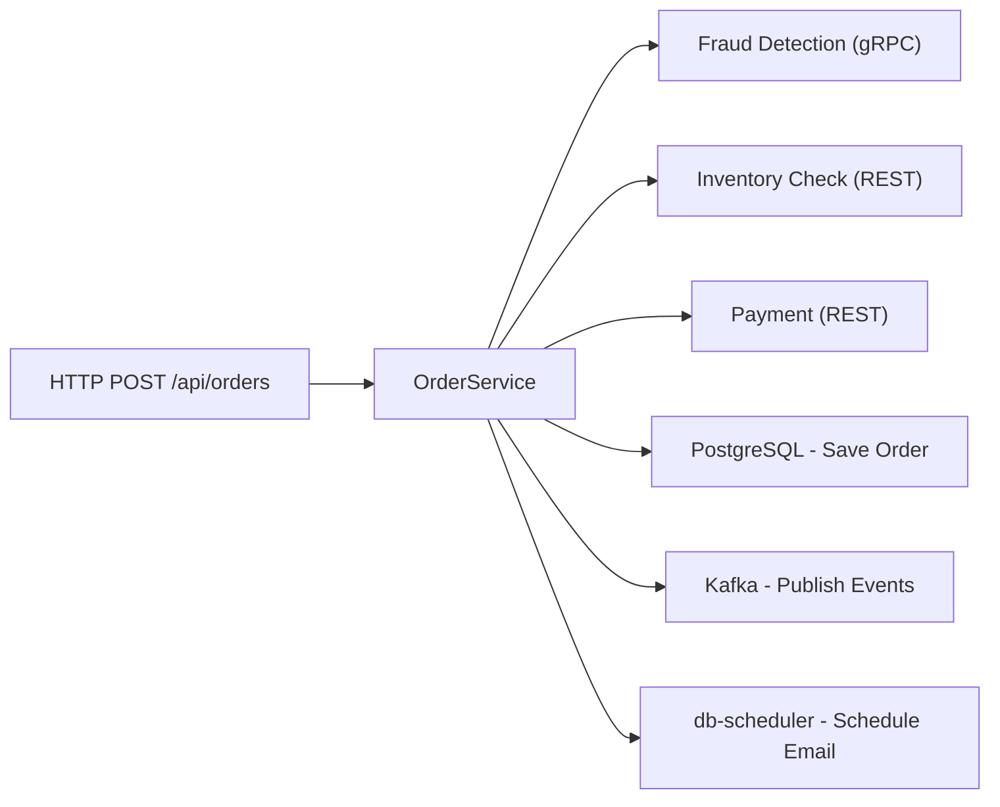
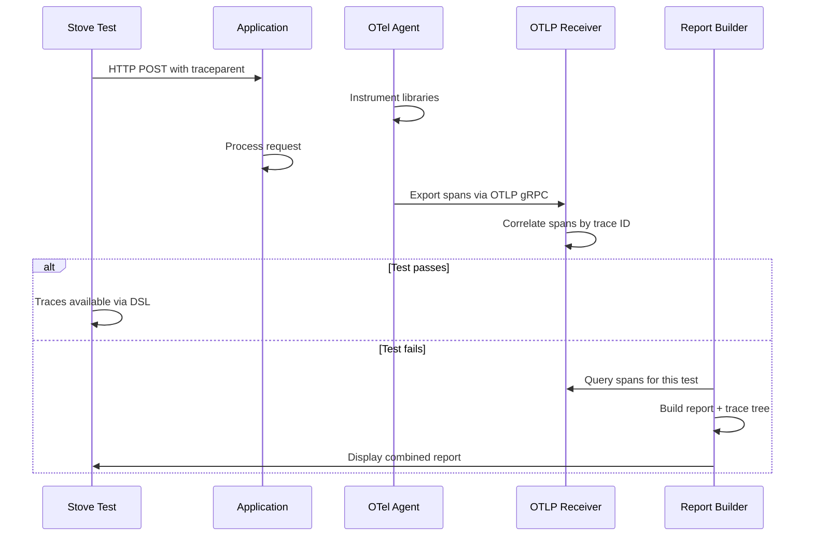

# Execution Tracing in Stove 0.21.0

If you've spent any time debugging e2e test failures, you know the routine. The test says <span data-rn="box" data-rn-color="#ef5350">"expected 201 but was 500"</span> and you're left reverse-engineering what actually happened. Did the request reach the controller? Did the database reject the write? Did a downstream service return something unexpected? You open the logs, grep for request IDs, cross-reference timestamps, and eventually piece together the story. Twenty minutes later, you have an answer.

The fundamental problem is that e2e tests treat the application as a black box. They can tell you the output was wrong, but they have no visibility into the execution path that produced it. For simple flows that's fine. For a request that touches a gRPC service, two REST APIs, a database, and a Kafka topic before returning a response, it's a real productivity drain. In a microservice architecture with multiple integration points, this kind of failure can easily take 30 minutes to diagnose. Multiply that by every flaky test in your CI pipeline, and the cost adds up fast.

Stove 0.21.0 introduces execution tracing to address this. When a test fails, you get the <span data-rn="highlight" data-rn-color="#00968855" data-rn-duration="800">entire call chain</span> of your application: every controller method, every database query, every Kafka message, every HTTP call, with timing and the exact point of failure. The bug might be buried deep in the persistence layer, but the trace pinpoints it without a single grep.

## Stove in 30 Seconds

For those new to [Stove](https://github.com/Trendyol/stove): it's an end-to-end testing framework for the JVM. It spins up your **real application** with **real dependencies** (PostgreSQL, Kafka, MongoDB, Redis, etc. via Testcontainers) and gives you a unified Kotlin DSL for assertions across all of them. It works with Spring Boot, Ktor, Micronaut, and Quarkus. Tests can be written in Kotlin, Java, or Scala.

The key idea: test your entire application stack as it runs in production, not a stripped-down mock version.

## A Real Application: The Spring Showcase

To demonstrate tracing, let's walk through a realistic application. The [spring-showcase](https://github.com/Trendyol/stove/tree/main/recipes/kotlin-recipes/spring-showcase) recipe is an order service that touches six different integration points during a single request:



Here's the service code. Each method is annotated with `@WithSpan` so the OpenTelemetry agent captures it:

```kotlin hl_lines="11"
@Service
class OrderService(
  private val orderRepository: OrderRepository,
  private val inventoryClient: InventoryClient,
  private val paymentClient: PaymentClient,
  private val fraudDetectionClient: FraudDetectionClient,
  private val eventPublisher: OrderEventPublisher,
  private val emailSchedulerService: EmailSchedulerService
) {
  @WithSpan("OrderService.createOrder")
  suspend fun createOrder(userId: String, productId: String, amount: Double): Order {
    // Step 1: Check fraud via gRPC
    checkFraudViaGrpc(orderId, userId, amount, productId)

    // Step 2: Check inventory via REST
    checkInventoryViaRest(productId)

    // Step 3: Process payment via REST
    val payment = processPaymentViaRest(userId, amount)

    // Step 4: Save to database
    val savedOrder = saveOrderToDatabase(orderId, userId, productId, amount, payment.transactionId!!)

    // Step 5: Publish events to Kafka
    publishEventsToKafka(savedOrder, payment.transactionId)

    // Step 6: Schedule confirmation email
    scheduleConfirmationEmail(savedOrder)

    return savedOrder
  }
}
```

And here's how the Stove test covers the entire flow in a single test:

```kotlin
test("The Complete Order Flow - Every Feature in One Test") {
  stove {
    // 1. Mock the external gRPC service (Fraud Detection)
    grpcMock {
      mockUnary(
        serviceName = "frauddetection.FraudDetectionService",
        methodName = "CheckFraud",
        response = CheckFraudResponse.newBuilder()
          .setIsFraudulent(false)
          .setRiskScore(0.15)
          .build()
      )
    }

    // 2. Mock the external REST APIs (Inventory + Payment)
    wiremock {
      mockGet(url = "/inventory/$productId", statusCode = 200,
        responseBody = InventoryResponse(productId, available = true, quantity = 10).some())
      mockPost(url = "/payments/charge", statusCode = 200,
        responseBody = PaymentResult(success = true, transactionId = "txn-123", amount = amount).some())
    }

    // 3. Call our API
    http {
      postAndExpectBody<OrderResponse>(uri = "/api/orders",
        body = CreateOrderRequest(userId, productId, amount).some()
      ) { response ->
        response.status shouldBe 201
        response.body().status shouldBe "CONFIRMED"
      }
    }

    // 4. Verify database state
    postgresql {
      shouldQuery<OrderRow>(
        query = "SELECT * FROM orders WHERE user_id = '$userId'",
        mapper = { row -> OrderRow(/* ... */) }
      ) { orders ->
        orders.size shouldBe 1
        orders.first().status shouldBe "CONFIRMED"
      }
    }

    // 5. Verify Kafka events
    kafka {
      shouldBePublished<OrderCreatedEvent> {
        actual.userId == userId && actual.productId == productId
      }
      shouldBePublished<PaymentProcessedEvent> {
        actual.amount == amount && actual.success
      }
    }

    // 6. Verify the consumer updated the read model (CQRS)
    kafka {
      shouldBeConsumed<OrderCreatedEvent> {
        actual.userId == userId
      }
    }

    // 7. Test our gRPC server
    grpc {
      channel<OrderQueryServiceCoroutineStub> {
        val order = getOrder(GetOrderRequest.newBuilder().setOrderId(orderId!!).build())
        order.found shouldBe true
      }
    }

    // 8. Verify scheduled tasks
    tasks {
      shouldBeExecuted<OrderEmailPayload> {
        this.orderId == orderId && this.userId == userId
      }
    }
  }
}
```

<span data-rn="highlight" data-rn-color="#00968855" data-rn-duration="800">One test covering eight integration points against real infrastructure.</span>

## Setting Up Tracing

Tracing takes <span data-rn="underline" data-rn-color="#009688">two configuration steps</span>.

### Step 1: Enable in your Stove config

```kotlin hl_lines="3-4"
Stove()
  .with {
    tracing {
      enableSpanReceiver()
    }
    // ... your other systems (http, kafka, postgresql, etc.)
  }
  .run()
```

### Step 2: Attach the OpenTelemetry agent in your build

Copy [`StoveTracingConfiguration.kt`](https://github.com/Trendyol/stove/blob/main/buildSrc/src/main/kotlin/com/trendyol/stove/gradle/StoveTracingConfiguration.kt) to your project's `buildSrc/src/main/kotlin/` directory, then add to your `build.gradle.kts`:

```kotlin hl_lines="3-4"
import com.trendyol.stove.gradle.configureStoveTracing

configureStoveTracing {
  serviceName = "my-service"
  testTaskNames = listOf("e2eTest") // optional: scope to specific test tasks
}
```

This handles downloading the OpenTelemetry Java Agent, configuring JVM arguments, attaching the agent to your test tasks, and dynamically assigning ports so parallel test runs don't conflict.

<span data-rn="highlight" data-rn-color="#4caf5044" data-rn-duration="800">No code changes to your application are needed.</span> The OpenTelemetry agent instruments 100+ libraries (Spring, JDBC, Kafka, gRPC, HTTP clients, Redis, MongoDB, and more) automatically. The `@WithSpan` annotations are optional. They add your own method-level spans on top of what the agent already captures.

## What Happens When a Test Fails

To see this in practice, we ran the spring-showcase with a bug deliberately injected in the persistence layer: a validation that rejects orders over $1000. The test output included the full execution report:

<div class="stove-report" data-rn-group>
<pre tabindex="0"><code>╔═════════════════════════════════════════════════════════════════════════════
                        STOVE TEST EXECUTION REPORT

 Test: The Complete Order Flow - Every Feature in One Test
 ID:   TheShowcase::The Complete Order Flow - Every Feature in One Test
 <span data-rn="highlight" data-rn-color="#ef535055" data-rn-duration="800">Status: FAILED</span>
╠═════════════════════════════════════════════════════════════════════════════

 TIMELINE
 ────────

 17:27:22.298 ✓ PASSED [gRPC Mock] Register unary stub: FraudDetectionService/CheckFraud
     Output: risk_score: 0.15 reason: "low_risk_user"

 17:27:22.335 ✓ PASSED [WireMock] Register stub: GET /inventory/macbook-pro-16
     Metadata: {statusCode=200}

 17:27:22.341 ✓ PASSED [WireMock] Register stub: POST /payments/charge
     Metadata: {statusCode=200}

 <span data-rn="box" data-rn-color="#ef5350">17:27:25.092 ✗ FAILED [HTTP] POST /api/orders</span>
     Input:  CreateOrderRequest(userId=user-4b9bb522, productId=macbook-pro-16, amount=2499.99)
     Output: {"message":"Internal server error","errorCode":"INTERNAL_ERROR"}
     Metadata: {status=500}
     Expected: Response&lt;OrderResponse&gt; matching expectation
     <span data-rn="underline" data-rn-color="#ef5350" data-rn-duration="400">Error: expected:&lt;201&gt; but was:&lt;500&gt;</span>

╠═════════════════════════════════════════════════════════════════════════════

 SYSTEM SNAPSHOTS
 ────────────────

 ┌─ GRPC MOCK ────────────────────────────
   Registered stubs: 1
   Received requests: 1
   Matched requests: 1

 ┌─ WIREMOCK ─────────────────────────────
   Registered stubs (this test): 2
   Served requests (this test): 2 (matched: 2)

 ┌─ KAFKA ────────────────────────────────
   Consumed: 0
   <span data-rn="highlight" data-rn-color="#ff980055" data-rn-duration="800">Published: 0</span>
   Failed: 0

╚═════════════════════════════════════════════════════════════════════════════</code></pre>
</div>

The report is structured in two parts. First, a timeline of every test step showing what passed and what failed. Then, a snapshot of each system's state at the moment of failure. You can already read the situation: the gRPC mock matched its request, WireMock served both stubs successfully, but Kafka has zero messages. The application crashed before it could publish any events.

Below the report, the **execution trace** shows what happened inside the application:

<div class="stove-report" data-rn-group>
<pre tabindex="0"><code>═══════════════════════════════════════════════════════════════
EXECUTION TRACE (Call Chain)
═══════════════════════════════════════════════════════════════

✓ POST /api/orders [250ms]
├── ✓ OrderService.createOrder [245ms]
│   ├── ✓ OrderService.checkFraudViaGrpc [30ms]
│   │   └── ✓ FraudDetectionClient.checkFraud [25ms]
│   ├── ✓ OrderService.checkInventoryViaRest [40ms]
│   │   └── http.url: http://localhost:54648/inventory/macbook-pro-16
│   ├── ✓ OrderService.processPaymentViaRest [35ms]
│   │   └── http.url: http://localhost:54648/payments/charge
│   <span data-rn="box" data-rn-color="#ef5350">├── ✗ OrderService.saveOrderToDatabase [8ms]  ◄── FAILURE POINT</span>
│   │   └── ✗ PostgresOrderRepository.save [5ms]
│   │       │  <span data-rn="highlight" data-rn-color="#ef535055">Error: OrderPersistenceException</span>
│   │       │  <span data-rn="highlight" data-rn-color="#ffd54f77" data-rn-duration="800">Message: Failed to persist order: amount exceeds internal threshold</span>
│   │       │    at PostgresOrderRepository.validateOrderAmount(PostgresOrderRepository.kt:102)
│   │       └── db.system: postgresql</code></pre>
</div>

The fraud, inventory, and payment steps all passed. The failure happened in `OrderService.saveOrderToDatabase`, specifically in `PostgresOrderRepository.save`, with the exception type, message, and stack trace right there. Without tracing, this would have been a 500 error with no context. With tracing, the root cause is <span data-rn="underline" data-rn-color="#009688">immediately visible</span>.

## Automatic Trace Propagation

Stove injects trace headers into every outgoing interaction without any test code changes:

- **HTTP requests** get a `traceparent` header
- **Kafka messages** get trace headers
- **gRPC calls** get trace metadata

This is visible in the actual test output. The HTTP request sent by Stove:

```
REQUEST: http://localhost:8024/api/orders
METHOD: POST
HEADERS:
  Accept: application/json
  X-Stove-Test-Id: TheShowcase::The Complete Order Flow - Every Feature in One Test
  traceparent: 00-475e686523af0b4ee0433f91a69a6b55-81edd5ba7e4dec42-01
```

And the WireMock request log confirming the propagation reached the downstream call:

```
Request received:
127.0.0.1 - GET /inventory/macbook-pro-16
  traceparent: [00-475e686523af0b4ee0433f91a69a6b55-e3f138ac02509a0b-01]
```

Same trace ID (`475e686523af0b4ee0433f91a69a6b55`), different span ID. The entire call chain is correlated.

## Per-Test Trace Isolation

A critical detail: <span data-rn="box" data-rn-color="#009688">every test gets its own trace</span>. Stove generates a unique trace ID at the start of each test and injects it into every outgoing interaction. All spans collected during that test are correlated back to that trace ID and that test alone.

This means traces from concurrent or sequential tests never bleed into each other. When a test fails, the execution trace shows *only* what happened during that specific test, not spans from a previous test that happened to use the same Kafka topic or a background job triggered by an earlier request.

This is not something you get for free with OpenTelemetry. In production, a trace starts when a request enters the system. In testing, there's no natural entry point. Stove creates one. It manages the W3C trace context lifecycle (start, propagate, end) per test, ties it to the test identity (`X-Stove-Test-Id` header), and ensures the OTLP receiver maps incoming spans to the correct test. The result is that tracing in Stove is <span data-rn="underline" data-rn-color="#ff9800">deterministic and test-scoped</span>, not a sampling-based best-effort like production tracing.

## Trace Validation DSL

Beyond automatic failure reports, you can actively assert on the execution flow using the `tracing { }` DSL. This is useful when you want to verify *how* your application handled a request, not just *that* it produced the right output:

```kotlin hl_lines="12-15 18 21 24"
test("order processing should call all expected services") {
  stove {
    http {
      postAndExpectBody<OrderResponse>("/api/orders", request.some()) { response ->
        response.status shouldBe 201
      }
    }

    tracing {
      // Verify which operations happened
      shouldContainSpan("OrderService.createOrder")
      shouldContainSpan("OrderService.checkFraudViaGrpc")
      shouldContainSpan("OrderService.checkInventoryViaRest")
      shouldContainSpan("PostgresOrderRepository.save")

      // Verify no operations failed
      shouldNotHaveFailedSpans()

      // Performance assertions
      executionTimeShouldBeLessThan(500.milliseconds)

      // Attribute assertions
      shouldHaveSpanWithAttribute("db.system", "postgresql")

      // Debugging helpers
      println(renderTree())    // Print the hierarchical tree
      println(renderSummary()) // Print compact summary
    }
  }
}
```

The DSL supports:

- **Span assertions**: `shouldContainSpan()`, `shouldNotContainSpan()`, `shouldContainSpanMatching()`
- **Failure assertions**: `shouldNotHaveFailedSpans()`, `shouldHaveFailedSpan()`
- **Performance assertions**: `executionTimeShouldBeLessThan()`, `spanCountShouldBeAtLeast()`
- **Attribute assertions**: `shouldHaveSpanWithAttribute()`, `shouldHaveSpanWithAttributeContaining()`
- **Query methods**: `findSpanByName()`, `getFailedSpans()`, `getTotalDuration()`
- **Async support**: `waitForSpans(expectedCount, timeoutMs)` for async flows

## How It Works



The architecture:

1. **OpenTelemetry Java Agent** attaches to your application process (configured via Gradle) and instruments 100+ libraries without code changes
2. **Stove starts an OTLP gRPC receiver** on a dynamically assigned port that collects spans exported by the agent
3. **W3C `traceparent` headers** are injected into every HTTP, Kafka, and gRPC interaction, correlating all spans back to the originating test
4. **On test failure**, the report builder queries the collected spans, builds a hierarchical tree, and renders it alongside the execution report
5. **Ports are dynamically assigned** so parallel test runs on CI don't conflict

Worth noting: the OTel agent does add some startup overhead to the test JVM (a few seconds). For most e2e test suites that spin up Testcontainers, this is negligible relative to container startup time. If it matters, tracing can be toggled off with `enabled = false` in the Gradle config.

## Practical Advice

1. **Enable tracing by default.** The overhead is minimal compared to container startup, and the diagnostic value on failure is significant.
2. **Use `tracing { }` sparingly.** The automatic failure reports cover most debugging needs. Reserve the DSL for cases where you want to assert on the execution flow itself, for example verifying that a cache was hit instead of the database.
3. **Start with `shouldNotHaveFailedSpans()`.** The simplest assertion that catches unexpected errors anywhere in the call chain.
4. **Filter noisy instrumentations.** Some libraries generate a lot of spans. Tune with `disabledInstrumentations`:

```kotlin
configureStoveTracing {
  serviceName = "my-service"
  disabledInstrumentations = listOf("jdbc", "hibernate", "spring-scheduling")
}
```

## Getting Started

Add the dependencies:

```kotlin
dependencies {
  testImplementation(platform("com.trendyol:stove-bom:0.21.0"))

  testImplementation("com.trendyol:stove")
  testImplementation("com.trendyol:stove-spring")       // or stove-ktor, stove-micronaut
  testImplementation("com.trendyol:stove-tracing")
  testImplementation("com.trendyol:stove-extensions-kotest") // or stove-extensions-junit
  // Add components as needed: stove-postgres, stove-kafka, stove-http, etc.
}
```

Enable tracing in two steps:

```kotlin
// build.gradle.kts
configureStoveTracing {
  serviceName = "my-service"
}

// Stove config
tracing {
  enableSpanReceiver()
}
```

For a complete working example, see the [spring-showcase recipe](https://github.com/Trendyol/stove/tree/main/recipes/kotlin-recipes/spring-showcase). It demonstrates all Stove features together (HTTP, gRPC, Kafka, PostgreSQL, WireMock, db-scheduler, and tracing) in a realistic Spring Boot application.

---

**Links:**

- [Stove on GitHub](https://github.com/Trendyol/stove)
- [Tracing documentation](../Components/15-tracing.md)
- [Spring Showcase recipe](https://github.com/Trendyol/stove/tree/main/recipes/kotlin-recipes/spring-showcase)
- [Full 0.21.0 release notes](../release-notes/0.21.0.md)
- [Getting started guide](../getting-started.md)
