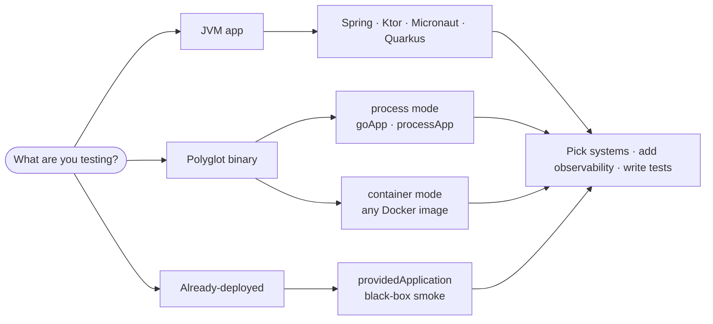

---
hide:
  - navigation
  - toc
---

<div class="stove-hero" markdown="0">
  <div class="stove-hero-text">
    <span class="stove-hero-kicker">End-to-end testing, for real</span>
    <h1>Test the runtime.<br/>Not the mocks.</h1>
    <p>Stove boots your real application with the real dependencies it talks to. Postgres, Kafka, Redis, gRPC, WireMock, and more. And lets you assert the whole flow in one DSL. JVM-first. Polyglot-ready.</p>
    <div class="stove-hero-actions">
      <a class="stove-btn primary" href="#setup-wizard">✨ Launch the wizard</a>
      <a class="stove-btn" href="getting-started/">Getting started</a>
      <a class="stove-btn" href="recipes/">Recipes</a>
      <a class="stove-btn" href="https://github.com/Trendyol/stove">GitHub →</a>
    </div>
  </div>
  <div class="stove-term">
<span class="stove-term-body"><span class="c">// boot real app + real deps, assert real behavior</span>
<span class="f">stove</span> {
  <span class="f">http</span> {
    <span class="f">post</span>&lt;<span class="f">OrderResponse</span>&gt;(<span class="s">"/orders"</span>, body) {
      <span class="f">it</span>.<span class="f">status</span> <span class="k">shouldBe</span> <span class="n">201</span>
    }
  }
  <span class="f">postgresql</span> {
    <span class="f">shouldQuery</span>&lt;<span class="f">OrderRow</span>&gt;(
      query = <span class="s">"SELECT * FROM orders"</span>,
      mapper = { row -> <span class="f">OrderRow</span>(row.string(<span class="s">"id"</span>)) }
    ) {
      <span class="f">it</span>.<span class="f">size</span> <span class="k">shouldBe</span> <span class="n">1</span>
    }
  }
  <span class="f">kafka</span> {
    <span class="f">shouldBePublished</span>&lt;<span class="f">OrderCreated</span>&gt; {
      <span class="f">actual</span>.<span class="f">userId</span> == <span class="f">userId</span>
    }
  }
}<span class="blink"></span></span></div>
</div>

<div class="stove-tldr" markdown>
<span class="stove-tldr-title">In 30 seconds</span>
Stove starts your app the way production starts it, hands it real containers (or shared infra), and gives you one DSL to drive HTTP, query databases, mock external calls, assert published events, and verify distributed traces. When a test fails, you get a timeline. Not a stack trace.
</div>

## What you actually get

<div class="stove-ribbon" markdown="0">
  <div class="stove-ribbon-item">
    <div class="icon">🧱</div>
    <strong>Real dependencies</strong>
    <p>Testcontainers under the hood, or wire to existing infra without Docker.</p>
  </div>
  <div class="stove-ribbon-item">
    <div class="icon">🎛️</div>
    <strong>One DSL, many systems</strong>
    <p>Same <code>stove { }</code> works across Postgres, Kafka, gRPC, WireMock, Redis, Mongo, ES, more.</p>
  </div>
  <div class="stove-ribbon-item">
    <div class="icon">🌐</div>
    <strong>Polyglot AUT</strong>
    <p>Spring/Ktor/Micronaut/Quarkus, plus Go/Python/Rust via process or container mode.</p>
  </div>
  <div class="stove-ribbon-item">
    <div class="icon">🛰️</div>
    <strong>Failures with context</strong>
    <p>One Gradle plugin (<code>stoveTracing</code>) + dashboard + MCP turn a red test into a call chain, timeline, and agent-readable evidence.</p>
  </div>
</div>

## <a id="setup-wizard"></a>Setup wizard

Pick runtime, framework, databases, mocks, observability. Wizard composes a paste-ready Gradle block, `StoveConfig.kt`, and a working sample test. State syncs to the URL; share or bookmark presets.

<div id="stove-wizard" markdown="0">
  <noscript>
    <div class="admonition warning">
      <p class="admonition-title">JavaScript required</p>
      <p>Wizard needs JavaScript. Follow <a href="getting-started/">Getting Started</a> for manual setup.</p>
    </div>
  </noscript>
</div>

## Pick your path { .stove-centered }

<div class="stove-centered" markdown>



</div>

<div class="grid cards stove-cards-center" markdown>

-   :material-magic-staff: **Setup Wizard**

    Compose your full setup in clicks.

    [Open wizard](wizard.md) · <a class="open-in-wizard" data-sys="postgresql,kafka" data-mk="wiremock">Postgres + Kafka + WireMock preset</a>

-   :material-book-open-page-variant: **Getting Started**

    The shared setup model and the DSL, once.

    [Read tutorial](getting-started.md)

-   :material-book-multiple: **Recipes**

    Real flows with full setup + test you can paste.

    [Browse recipes](recipes/index.md)

-   :material-language-kotlin: **JVM frameworks**

    Spring Boot · Ktor · Micronaut · Quarkus.

    [Framework guides](frameworks/index.md)

-   :material-language-go: **Polyglot**

    Go, Python, Node, Rust via process or container mode.

    [Polyglot overview](other-languages/index.md)

-   :material-cloud-check: **Smoke test deployed app**

    Run Stove against an already-running service. Any language.

    [Provided Application](Components/19-provided-application.md)

-   :material-server-network: **No Docker / CI shared infra**

    Connect to existing databases and brokers. Testcontainers off.

    [Provided Instances](Components/11-provided-instances.md)

-   :material-chart-timeline: **When a test fails**

    Scroll story: assertion → console → dashboard → trace → MCP triage.

    [Walk through it](observability/when-it-fails.md)

</div>

## Why Stove exists

JVM frameworks are great. E2E test setup around them is not. Teams keep rebuilding the same boilerplate. Container lifecycle, port wiring, config injection, cleanup, diagnostics. Once per service.

<div class="stove-compare" markdown="0">
  <div>
    <h4>Without Stove</h4>
    <ul>
      <li>Hand-rolled Testcontainers setup per service</li>
      <li>Mocks where they shouldn't be (the bug hides there)</li>
      <li>Framework-specific test harness rewritten each time</li>
      <li>Failures = stack traces, no context</li>
      <li>Polyglot services need a separate test stack</li>
    </ul>
  </div>
  <div>
    <h4>With Stove</h4>
    <ul>
      <li>Declarative <code>Stove().with { ... }</code> wiring</li>
      <li>Real DB, real broker, real downstream (mocked at the boundary)</li>
      <li>One DSL across Spring · Ktor · Micronaut · Quarkus</li>
      <li>Failures come with timeline, trace tree, MCP evidence</li>
      <li>Go/Python/Rust apps drop in via process/container mode</li>
    </ul>
  </div>
</div>

<span data-rn="highlight" data-rn-color="#00968855" data-rn-duration="800">One testing model. Many stacks.</span>

## Architecture


## Building from source

```shell
# requires JDK 17+ and Docker
./gradlew build
```

Background and motivation: original [Medium article](https://medium.com/trendyol-tech/a-new-approach-to-the-api-end-to-end-testing-in-kotlin-f743fd1901f5).
