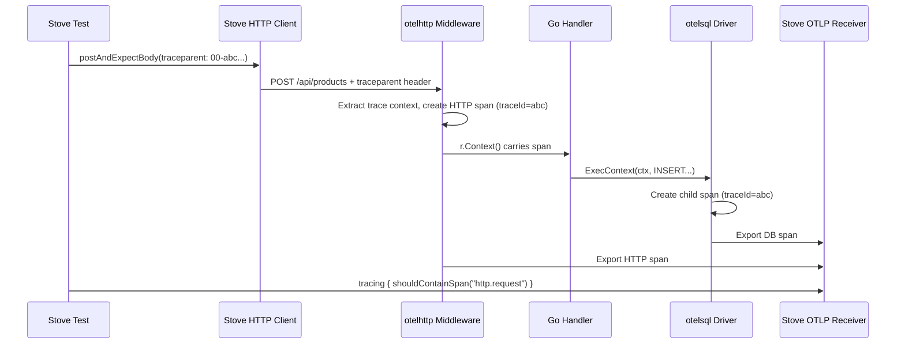

# <span data-rn="underline" data-rn-color="#ff9800">Go</span>

This guide walks through testing a Go application with Stove --- end to end, including <span data-rn="highlight" data-rn-color="#00968855" data-rn-duration="800">HTTP, PostgreSQL, distributed tracing, and the dashboard</span>. The Go app is a simple product CRUD service; Stove starts it as an OS process, passes infrastructure configs as environment variables, and runs Kotlin e2e tests against it.

The full source is at [`recipes/go-recipes/go-showcase`](https://github.com/Trendyol/stove/tree/main/recipes/go-recipes/go-showcase).

## Project Structure

```
go-showcase/
  product-app-go/              # Go application source
    go.mod
    main.go                    # Entry point, env var config, graceful shutdown
    db.go                      # PostgreSQL queries (auto-traced via otelsql)
    handlers.go                # HTTP handlers (auto-traced via otelhttp)
    tracing.go                 # OpenTelemetry SDK initialization
  src/test-e2e/                # Kotlin Stove tests
    kotlin/com/.../e2e/
      setup/
        GoApplicationUnderTest.kt   # Custom AUT: starts Go binary
        StoveConfig.kt              # Stove system configuration
        ProductMigration.kt         # Creates products table
      tests/
        GoShowcaseTest.kt           # E2E tests
    resources/
      kotest.properties
  build.gradle.kts             # Builds Go + runs Kotlin tests
```

## The Go Application

A minimal HTTP + PostgreSQL service. The key design choice: <span data-rn="underline" data-rn-color="#009688">all tracing is in the infrastructure layer</span>, not in business logic.

### Entry Point

```go title="main.go"
func main() {
    ctx := context.Background()
    port := getEnv("APP_PORT", "8080")

    // Initialize OTel tracing (no-ops gracefully if endpoint not set)
    shutdownTracing, _ := initTracing(ctx, "go-showcase")
    defer shutdownTracing(ctx)

    db, _ := initDB(connStr)  // otelsql wraps database/sql automatically
    defer db.Close()

    mux := http.NewServeMux()
    registerRoutes(mux, db)

    // otelhttp middleware creates spans for every HTTP request
    handler := otelhttp.NewHandler(mux, "http.request")

    server := &http.Server{Addr: ":" + port, Handler: handler}
    // ... graceful shutdown on SIGTERM
}
```

Configuration comes entirely from environment variables:

| Variable | Purpose | Default |
|----------|---------|---------|
| `APP_PORT` | HTTP listen port | `8080` |
| `DB_HOST`, `DB_PORT`, `DB_NAME`, `DB_USER`, `DB_PASS` | PostgreSQL connection | `localhost`, `5432`, `stove`, `sa`, `sa` |
| `OTEL_EXPORTER_OTLP_ENDPOINT` | OTLP gRPC endpoint for traces | *(disabled if empty)* |

### Handlers

Handlers are pure business logic --- no tracing imports:

```go title="handlers.go"
func handleCreateProduct(db *sql.DB) http.HandlerFunc {
    return func(w http.ResponseWriter, r *http.Request) {
        var req createProductRequest
        if err := json.NewDecoder(r.Body).Decode(&req); err != nil {
            http.Error(w, `{"error":"invalid request body"}`, http.StatusBadRequest)
            return
        }

        product := Product{ID: uuid.New().String(), Name: req.Name, Price: req.Price}

        if err := insertProduct(r.Context(), db, product); err != nil {
            http.Error(w, `{"error":"failed to create product"}`, http.StatusInternalServerError)
            return
        }

        w.Header().Set("Content-Type", "application/json")
        w.WriteHeader(http.StatusCreated)
        json.NewEncoder(w).Encode(product)
    }
}
```

Notice: `r.Context()` is passed to the DB function. This is standard Go practice, and it's all that's needed for trace propagation --- the `otelhttp` middleware puts a span in the context, and `otelsql` creates child spans from it.

### Database

Database functions are equally clean --- no tracing boilerplate:

```go title="db.go"
func initDB(connStr string) (*sql.DB, error) {
    // otelsql wraps database/sql --- all queries are automatically traced
    db, err := otelsql.Open("postgres", connStr,
        otelsql.WithAttributes(semconv.DBSystemPostgreSQL),
    )
    // ...
}

func insertProduct(ctx context.Context, db *sql.DB, p Product) error {
    _, err := db.ExecContext(ctx,
        "INSERT INTO products (id, name, price) VALUES ($1, $2, $3)",
        p.ID, p.Name, p.Price,
    )
    return err
}
```

### Tracing Setup

The OTel SDK initialization is the only place with tracing imports:

```go title="tracing.go"
func initTracing(ctx context.Context, serviceName string) (func(context.Context), error) {
    endpoint := os.Getenv("OTEL_EXPORTER_OTLP_ENDPOINT")
    if endpoint == "" {
        return func(context.Context) {}, nil  // Graceful no-op
    }

    conn, _ := grpc.NewClient(endpoint, grpc.WithTransportCredentials(insecure.NewCredentials()))
    exporter, _ := otlptracegrpc.New(ctx, otlptracegrpc.WithGRPCConn(conn))

    tp := sdktrace.NewTracerProvider(
        sdktrace.WithSyncer(exporter),   // Sync export for tests (no batching delay)
        sdktrace.WithResource(resource.NewWithAttributes(
            semconv.SchemaURL,
            semconv.ServiceNameKey.String(serviceName),
        )),
    )

    otel.SetTracerProvider(tp)
    otel.SetTextMapPropagator(propagation.NewCompositeTextMapPropagator(
        propagation.TraceContext{},  // W3C traceparent
        propagation.Baggage{},
    ))

    return func(ctx context.Context) { tp.Shutdown(ctx) }, nil
}
```

!!! tip "Sync vs Batch Exporter"
    Use `WithSyncer(exporter)` for tests so spans are exported immediately when they end. In production, use `WithBatcher(exporter)` for better performance. The 5-second default batch interval would cause test assertions to fail because spans wouldn't arrive in time.

!!! info "W3C Trace Context Propagation"
    Setting `propagation.TraceContext{}` is essential. Stove's HTTP client sends a `traceparent` header with each request. The `otelhttp` middleware extracts it, so all spans in the Go app share the same trace ID as the test. This is what makes `tracing { shouldContainSpan(...) }` assertions work.

## Go Dependencies

```
go.opentelemetry.io/contrib/instrumentation/net/http/otelhttp  # HTTP middleware
go.opentelemetry.io/otel                                        # OTel API
go.opentelemetry.io/otel/exporters/otlp/otlptrace/otlptracegrpc # OTLP gRPC exporter
go.opentelemetry.io/otel/sdk                                    # OTel SDK
github.com/XSAM/otelsql                                         # database/sql auto-instrumentation
github.com/lib/pq                                                # PostgreSQL driver
google.golang.org/grpc                                           # gRPC (for OTLP export)
```

## Stove Test Setup

### Gradle Build

Gradle compiles the Go binary and passes its path to the test:

```kotlin title="build.gradle.kts"
val goSourceDir = project.file("product-app-go")
val goBinary = project.layout.buildDirectory.file("go-app").get().asFile

tasks.register<Exec>("buildGoApp") {
    description = "Compiles the Go application."
    group = "build"
    workingDir = goSourceDir
    commandLine("go", "build", "-o", goBinary.absolutePath, ".")

    inputs.files(fileTree(goSourceDir) { include("*.go", "go.mod", "go.sum") })
    outputs.file(goBinary)
}

tasks.named<Test>("e2eTest") {
    dependsOn("buildGoApp")
    systemProperty("go.app.binary", goBinary.absolutePath)
}

dependencies {
    testImplementation(stoveLibs.stove)
    testImplementation(stoveLibs.stovePostgres)
    testImplementation(stoveLibs.stoveHttp)
    testImplementation(stoveLibs.stoveTracing)
    testImplementation(stoveLibs.stoveDashboard)
    testImplementation(stoveLibs.stoveExtensionsKotest)
}
```

Running `./gradlew e2eTest` compiles the Go binary first, then runs the Kotlin tests.

### GoApplicationUnderTest

The custom `ApplicationUnderTest` starts the Go binary as an OS process:

```kotlin title="GoApplicationUnderTest.kt" hl_lines="8-10 14-20 25-29"
@StoveDsl
class GoApplicationUnderTest(
    private val binaryPath: String,
    private val port: Int,
    private val configMapper: (List<String>) -> Map<String, String>
) : ApplicationUnderTest<Unit> {

    override suspend fun start(configurations: List<String>) {
        // Convert Stove configs ("database.host=localhost") to env vars ("DB_HOST=localhost")
        val envVars = configMapper(configurations)

        val processBuilder = ProcessBuilder(binaryPath)
            .redirectErrorStream(true)
        processBuilder.environment().putAll(envVars)
        processBuilder.environment()["APP_PORT"] = port.toString()

        process = processBuilder.start()
        launchOutputReader(process!!)
        waitForHealth("http://localhost:$port/health")
    }

    override suspend fun stop() {
        process?.let { p ->
            p.destroy()                    // SIGTERM
            if (!p.waitFor(5, TimeUnit.SECONDS)) {
                p.destroyForcibly()        // Force kill
            }
        }
    }
}
```

The `configMapper` is the bridge between Stove's configuration format (`key=value` strings) and your app's environment variables:

```kotlin
fun WithDsl.goApp(
    binaryPath: String = System.getProperty("go.app.binary")
        ?: error("go.app.binary system property not set"),
    port: Int,
    configMapper: (List<String>) -> Map<String, String>
): Stove {
    this.stove.applicationUnderTest(GoApplicationUnderTest(binaryPath, port, configMapper))
    return this.stove
}
```

### Stove Configuration

```kotlin title="StoveConfig.kt" hl_lines="6-8 10-12 20-35"
Stove()
    .with {
        httpClient {
            HttpClientSystemOptions(baseUrl = "http://localhost:$APP_PORT")
        }

        dashboard {
            DashboardSystemOptions(appName = "go-showcase")
        }

        tracing {
            enableSpanReceiver(port = OTLP_PORT)
        }

        postgresql {
            PostgresqlOptions(
                databaseName = "stove",
                configureExposedConfiguration = { cfg ->
                    listOf(
                        "database.host=${cfg.host}",
                        "database.port=${cfg.port}",
                        "database.name=stove",
                        "database.username=${cfg.username}",
                        "database.password=${cfg.password}"
                    )
                }
            ).migrations {
                register<ProductMigration>()
            }
        }

        goApp(
            port = APP_PORT,
            configMapper = { configs ->
                val map = configs.associate { line ->
                    val (key, value) = line.split("=", limit = 2)
                    key to value
                }
                buildMap {
                    map["database.host"]?.let { put("DB_HOST", it) }
                    map["database.port"]?.let { put("DB_PORT", it) }
                    map["database.name"]?.let { put("DB_NAME", it) }
                    map["database.username"]?.let { put("DB_USER", it) }
                    map["database.password"]?.let { put("DB_PASS", it) }
                    put("OTEL_EXPORTER_OTLP_ENDPOINT", "localhost:$OTLP_PORT")
                }
            }
        )
    }.run()
```

The `configMapper` receives Stove's exposed configurations (from `configureExposedConfiguration` in each system) and translates them to the environment variables the Go app expects.

### Database Migration

Stove creates the table before the Go app starts:

```kotlin title="ProductMigration.kt"
class ProductMigration : DatabaseMigration<PostgresSqlMigrationContext> {
    override val order: Int = 1

    override suspend fun execute(connection: PostgresSqlMigrationContext) {
        connection.sql.execute(
            queryOf("""
                CREATE TABLE IF NOT EXISTS products (
                    id VARCHAR(255) PRIMARY KEY,
                    name VARCHAR(255) NOT NULL,
                    price DECIMAL(10, 2) NOT NULL
                )
            """).asExecute
        )
    }
}
```

## Writing Tests

Tests use the standard Stove DSL --- identical to how you'd test a Spring Boot app:

```kotlin title="GoShowcaseTest.kt"
class GoShowcaseTest : FunSpec({

    test("should create a product and verify via HTTP, database, and traces") {
        stove {
            val productName = "Stove Go Showcase Product"
            val productPrice = 42.99
            var productId: String? = null

            // 1. Create via REST API
            http {
                postAndExpectBody<ProductResponse>(
                    uri = "/api/products",
                    body = CreateProductRequest(name = productName, price = productPrice).some()
                ) { actual ->
                    actual.status shouldBe 201
                    productId = actual.body().id
                }
            }

            // 2. Verify database state
            postgresql {
                shouldQuery<ProductRow>(
                    query = "SELECT id, name, price FROM products WHERE id = '$productId'",
                    mapper = { row ->
                        ProductRow(row.string("id"), row.string("name"), row.double("price"))
                    }
                ) { rows ->
                    rows.size shouldBe 1
                    rows.first().name shouldBe productName
                }
            }

            // 3. Read back via HTTP
            http {
                getResponse<ProductResponse>(uri = "/api/products/$productId") { actual ->
                    actual.status shouldBe 200
                    actual.body().name shouldBe productName
                }
            }

            // 4. Verify distributed traces from the Go app
            tracing {
                waitForSpans(4, 5000)
                shouldContainSpan("http.request")
                shouldNotHaveFailedSpans()
                spanCountShouldBeAtLeast(4)
                executionTimeShouldBeLessThan(10.seconds)
            }
        }
    }
})
```

## How Tracing Flows

Understanding how traces propagate between Stove and the Go app:

```
1. StoveKotestExtension starts a TraceContext before each test
2. Stove HTTP client injects `traceparent` header into requests
3. otelhttp middleware extracts traceparent, creates HTTP span as child
4. Handler passes r.Context() to DB functions
5. otelsql creates DB spans as children of the HTTP span
6. All spans share the same trace ID as the test
7. Spans are exported via OTLP gRPC to Stove's receiver
8. tracing { shouldContainSpan(...) } queries spans by trace ID
```



## Running

```bash
# From the recipes directory
./gradlew go-recipes:go-showcase:e2eTest
```

This will:

1. Compile the Go binary (`go build`)
2. Start a PostgreSQL container (Testcontainers)
3. Run database migrations
4. Start the OTLP span receiver
5. Launch the Go binary with database and tracing env vars
6. Run the Kotlin e2e tests
7. Stop everything and clean up

## Adapting for Other Languages

The same pattern works for any language. Replace the Go-specific parts:

| Part | Go | Python | Node.js | Rust |
|------|-----|--------|---------|------|
| **Build step** | `go build` | *(none or pip install)* | `npm install && npm run build` | `cargo build` |
| **Binary** | Single executable | `python app.py` | `node dist/index.js` | Single executable |
| **OTel HTTP** | `otelhttp.NewHandler` | `opentelemetry-instrumentation-flask` | `@opentelemetry/instrumentation-http` | `tracing-opentelemetry` |
| **OTel DB** | `otelsql` | `opentelemetry-instrumentation-psycopg2` | `@opentelemetry/instrumentation-pg` | `tracing-opentelemetry` |
| **Config** | Env vars | Env vars | Env vars | Env vars |

The Kotlin test side stays exactly the same --- only `GoApplicationUnderTest` and the `configMapper` change.
