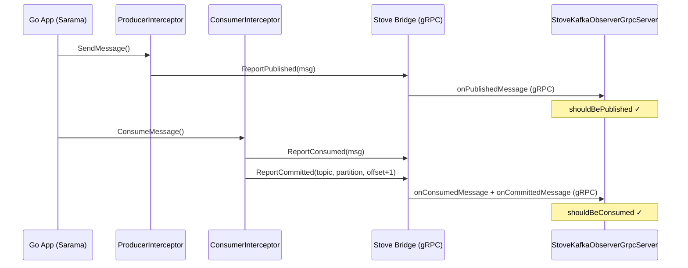
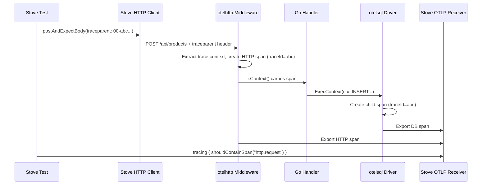

# <span data-rn="underline" data-rn-color="#ff9800">Go</span>

This guide walks through testing a Go application with Stove --- end to end, including <span data-rn="highlight" data-rn-color="#00968855" data-rn-duration="800">HTTP, PostgreSQL, Kafka, distributed tracing, and the dashboard</span>. The Go app is a simple product CRUD service; Stove starts it as an OS process, passes infrastructure configs as environment variables, and runs Kotlin e2e tests against it.

The full source is at [`recipes/go-recipes/go-showcase`](https://github.com/Trendyol/stove/tree/main/recipes/go-recipes/go-showcase).

## Project Structure

```
go-showcase/
  product-app-go/              # Go application source
    go.mod
    main.go                    # Entry point, env var config, graceful shutdown
    db.go                      # PostgreSQL queries (auto-traced via otelsql)
    handlers.go                # HTTP handlers + Kafka publish (auto-traced via otelhttp)
    kafka.go                   # KafkaProducer interface, factory, shared consumer handler
    kafka_sarama.go            # IBM/sarama implementation
    kafka_franz.go             # twmb/franz-go implementation
    kafka_segmentio.go         # segmentio/kafka-go implementation
    tracing.go                 # OpenTelemetry SDK initialization
  src/test-e2e/                # Kotlin Stove tests
    kotlin/com/.../e2e/
      setup/
        GoApplicationUnderTest.kt   # Custom AUT: starts Go binary
        StoveConfig.kt              # Stove system configuration
        ProductMigration.kt         # Creates products table
      tests/
        GoShowcaseTest.kt           # E2E tests
    resources/
      kotest.properties
  build.gradle.kts             # Builds Go + runs Kotlin tests

# Distributed as a Go library:
go/stove-kafka/            # Stove Kafka bridge for Go applications
  bridge.go                    # Core bridge (library-agnostic gRPC client)
  sarama/                      # IBM/sarama interceptors
    interceptors.go
  franz/                       # twmb/franz-go hooks
    hooks.go
  segmentio/                     # segmentio/kafka-go helpers
    bridge.go
  stoveobserver/               # Generated gRPC code from messages.proto
  go.mod
```

## The Go Application

A minimal HTTP + PostgreSQL service. The key design choice: <span data-rn="underline" data-rn-color="#009688">all tracing is in the infrastructure layer</span>, not in business logic.

### Entry Point

```go title="main.go"
func main() {
    ctx := context.Background()
    port := getEnv("APP_PORT", "8080")

    // Initialize OTel tracing (no-ops gracefully if endpoint not set)
    shutdownTracing, _ := initTracing(ctx, "go-showcase")
    defer shutdownTracing(ctx)

    db, _ := initDB(connStr)  // otelsql wraps database/sql automatically
    defer db.Close()

    // Initialize Stove Kafka bridge (nil in production — zero overhead)
    bridge, _ := stovekafka.NewBridgeFromEnv()
    defer bridge.Close()

    // Initialize Kafka producer and consumer (library chosen by KAFKA_LIBRARY env var)
    kafkaLibrary := getEnv("KAFKA_LIBRARY", "sarama")
    producer, stopKafka, _ := initKafka(kafkaLibrary, brokers, db, bridge)
    defer stopKafka()

    mux := http.NewServeMux()
    registerRoutes(mux, db, producer)

    // otelhttp middleware creates spans for every HTTP request
    handler := otelhttp.NewHandler(mux, "http.request")

    server := &http.Server{Addr: ":" + port, Handler: handler}
    // ... graceful shutdown on SIGTERM
}
```

Configuration comes entirely from environment variables:

| Variable | Purpose | Default |
|----------|---------|---------|
| `APP_PORT` | HTTP listen port | `8080` |
| `DB_HOST`, `DB_PORT`, `DB_NAME`, `DB_USER`, `DB_PASS` | PostgreSQL connection | `localhost`, `5432`, `stove`, `sa`, `sa` |
| `OTEL_EXPORTER_OTLP_ENDPOINT` | OTLP gRPC endpoint for traces | *(disabled if empty)* |
| `KAFKA_BROKERS` | Comma-separated Kafka broker addresses | *(disabled if empty)* |
| `KAFKA_LIBRARY` | Kafka client library to use: `sarama`, `franz`, or `segmentio` | `sarama` |
| `STOVE_KAFKA_BRIDGE_PORT` | Stove Kafka bridge gRPC port | *(disabled if empty, test-only)* |

### Handlers

Handlers are pure business logic --- no tracing imports:

```go title="handlers.go"
func handleCreateProduct(db *sql.DB, producer KafkaProducer) http.HandlerFunc {
    return func(w http.ResponseWriter, r *http.Request) {
        var req createProductRequest
        if err := json.NewDecoder(r.Body).Decode(&req); err != nil {
            http.Error(w, `{"error":"invalid request body"}`, http.StatusBadRequest)
            return
        }

        product := Product{ID: uuid.New().String(), Name: req.Name, Price: req.Price}

        if err := insertProduct(r.Context(), db, product); err != nil {
            http.Error(w, `{"error":"failed to create product"}`, http.StatusInternalServerError)
            return
        }

        // Publish ProductCreatedEvent to Kafka (works with any library)
        if producer != nil {
            event := ProductCreatedEvent{ID: product.ID, Name: product.Name, Price: product.Price}
            eventBytes, _ := json.Marshal(event)
            producer.SendMessage(topicProductCreated, product.ID, eventBytes)
        }

        writeJSON(w, http.StatusCreated, product)
    }
}
```

The `KafkaProducer` interface abstracts away the Kafka client library:

```go title="kafka.go"
type KafkaProducer interface {
    SendMessage(topic, key string, value []byte) error
    Close() error
}

func initKafka(library, brokers string, db *sql.DB, bridge *stovekafka.Bridge) (KafkaProducer, func(), error) {
    groupID := "go-showcase-" + library
    switch library {
    case "franz":
        return initFranzKafka(brokers, groupID, db, bridge)
    case "segmentio":
        return initSegmentioKafka(brokers, groupID, db, bridge)
    default:
        return initSaramaKafka(brokers, groupID, db, bridge)
    }
}
```

Notice: `r.Context()` is passed to the DB function. This is standard Go practice, and it's all that's needed for trace propagation --- the `otelhttp` middleware puts a span in the context, and `otelsql` creates child spans from it.

### Database

Database functions are equally clean --- no tracing boilerplate:

```go title="db.go"
func initDB(connStr string) (*sql.DB, error) {
    // otelsql wraps database/sql --- all queries are automatically traced
    db, err := otelsql.Open("postgres", connStr,
        otelsql.WithAttributes(semconv.DBSystemPostgreSQL),
    )
    // ...
}

func insertProduct(ctx context.Context, db *sql.DB, p Product) error {
    _, err := db.ExecContext(ctx,
        "INSERT INTO products (id, name, price) VALUES ($1, $2, $3)",
        p.ID, p.Name, p.Price,
    )
    return err
}
```

### Tracing Setup

The OTel SDK initialization is the only place with tracing imports:

```go title="tracing.go"
func initTracing(ctx context.Context, serviceName string) (func(context.Context), error) {
    endpoint := os.Getenv("OTEL_EXPORTER_OTLP_ENDPOINT")
    if endpoint == "" {
        return func(context.Context) {}, nil  // Graceful no-op
    }

    conn, _ := grpc.NewClient(endpoint, grpc.WithTransportCredentials(insecure.NewCredentials()))
    exporter, _ := otlptracegrpc.New(ctx, otlptracegrpc.WithGRPCConn(conn))

    tp := sdktrace.NewTracerProvider(
        sdktrace.WithSyncer(exporter),   // Sync export for tests (no batching delay)
        sdktrace.WithResource(resource.NewWithAttributes(
            semconv.SchemaURL,
            semconv.ServiceNameKey.String(serviceName),
        )),
    )

    otel.SetTracerProvider(tp)
    otel.SetTextMapPropagator(propagation.NewCompositeTextMapPropagator(
        propagation.TraceContext{},  // W3C traceparent
        propagation.Baggage{},
    ))

    return func(ctx context.Context) { tp.Shutdown(ctx) }, nil
}
```

!!! tip "Sync vs Batch Exporter"
    Use `WithSyncer(exporter)` for tests so spans are exported immediately when they end. In production, use `WithBatcher(exporter)` for better performance. The 5-second default batch interval would cause test assertions to fail because spans wouldn't arrive in time.

!!! info "W3C Trace Context Propagation"
    Setting `propagation.TraceContext{}` is essential. Stove's HTTP client sends a `traceparent` header with each request. The `otelhttp` middleware extracts it, so all spans in the Go app share the same trace ID as the test. This is what makes `tracing { shouldContainSpan(...) }` assertions work.

## Kafka

Stove provides a Go bridge library (`stove-kafka`) that enables `shouldBeConsumed` and `shouldBePublished` assertions for Go applications. The bridge forwards produced/consumed messages via gRPC to Stove's `StoveKafkaObserverGrpcServer`. The core is library-agnostic; client-specific subpackages provide interceptors/hooks for popular Go Kafka libraries:

| Library | Subpackage | Integration |
|---------|-----------|-------------|
| [IBM/sarama](https://github.com/IBM/sarama) | `sarama` | `ProducerInterceptor` / `ConsumerInterceptor` |
| [twmb/franz-go](https://github.com/twmb/franz-go) | `franz` | `kgo.WithHooks(&franz.Hook{...})` |
| [segmentio/kafka-go](https://github.com/segmentio/kafka-go) | `segmentio` | `segmentio.ReportWritten()` / `segmentio.ReportRead()` |

!!! tip "Using other Kafka libraries (e.g. confluent-kafka-go)"
    The subpackages above are conveniences. The core bridge (`PublishedMessage`, `ConsumedMessage`, `Bridge`) has **no Kafka client dependency**. For any library not listed above, import only the core package and call `bridge.ReportPublished()`, `bridge.ReportConsumed()`, and `bridge.ReportCommitted()` directly with your own type conversion:

    ```go
    import stovekafka "github.com/trendyol/stove/go/stove-kafka"

    bridge, _ := stovekafka.NewBridgeFromEnv()

    // After producing
    _ = bridge.ReportPublished(ctx, &stovekafka.PublishedMessage{
        Topic: msg.Topic, Key: string(msg.Key), Value: msg.Value,
        Headers: myHeaders(msg),
    })

    // After consuming
    _ = bridge.ReportConsumed(ctx, &stovekafka.ConsumedMessage{
        Topic: msg.Topic, Key: string(msg.Key), Value: msg.Value,
        Partition: msg.Partition, Offset: msg.Offset,
        Headers: myHeaders(msg),
    })
    _ = bridge.ReportCommitted(ctx, msg.Topic, msg.Partition, msg.Offset+1)
    ```

### How It Works



In production, `STOVE_KAFKA_BRIDGE_PORT` is not set, so `NewBridgeFromEnv()` returns `nil`. All Bridge methods are nil-safe no-ops --- zero overhead.

### Integrating the Bridge (Step by Step)

Follow these steps to add Stove Kafka support to your Go application:

#### Step 1: Add the dependency

```bash
go get github.com/trendyol/stove/go/stove-kafka
```

#### Step 2: Initialize the bridge in your app

```go
import stovekafka "github.com/trendyol/stove/go/stove-kafka"

// Returns nil when STOVE_KAFKA_BRIDGE_PORT is not set (production mode)
bridge, err := stovekafka.NewBridgeFromEnv()
if err != nil {
    log.Fatalf("failed to init stove bridge: %v", err)
}
defer bridge.Close()
```

#### Step 3: Wire the bridge into your Kafka client

Choose the tab matching your Go Kafka library:

=== "IBM/sarama"

    ```go title="kafka.go"
    import stovesarama "github.com/trendyol/stove/go/stove-kafka/sarama"

    config := sarama.NewConfig()
    config.Producer.Interceptors = []sarama.ProducerInterceptor{
        &stovesarama.ProducerInterceptor{Bridge: bridge},
    }
    config.Consumer.Interceptors = []sarama.ConsumerInterceptor{
        &stovesarama.ConsumerInterceptor{Bridge: bridge},
    }
    ```

=== "twmb/franz-go"

    ```go title="kafka.go"
    import "github.com/trendyol/stove/go/stove-kafka/franz"

    client, err := kgo.NewClient(
        kgo.SeedBrokers("localhost:9092"),
        kgo.WithHooks(&franz.Hook{Bridge: bridge}),
    )
    ```

=== "segmentio/kafka-go"

    ```go title="kafka.go"
    import "github.com/trendyol/stove/go/stove-kafka/segmentio"

    // After producing
    err := writer.WriteMessages(ctx, msgs...)
    segmentio.ReportWritten(ctx, bridge, msgs...)

    // After consuming
    msg, err := reader.ReadMessage(ctx)
    segmentio.ReportRead(ctx, bridge, msg)
    ```

When Bridge is nil (production), all interceptors/helpers return immediately with zero overhead.

#### Step 4: Add `stoveKafka` to your Gradle test dependencies

```kotlin title="build.gradle.kts"
dependencies {
    testImplementation(stoveLibs.stoveKafka)
}
```

#### Step 5: Register the Kafka system in your Stove config

```kotlin title="StoveConfig.kt"
kafka {
    KafkaSystemOptions(
        configureExposedConfiguration = { cfg ->
            listOf("kafka.bootstrapServers=${cfg.bootstrapServers}")
        }
    )
}
```

Pass the bridge port and broker address to your Go app via `configMapper`:

```kotlin
map["kafka.bootstrapServers"]?.let { put("KAFKA_BROKERS", it) }
put("STOVE_KAFKA_BRIDGE_PORT", stoveKafkaBridgePortDefault)
```

#### Step 6: Write Kafka assertions in your tests

```kotlin
kafka {
    shouldBePublished<MyEvent>(10.seconds) { actual.id == expectedId }
    shouldBeConsumed<MyEvent>(10.seconds) { actual.id == expectedId }
    publish("my.topic", MyEvent(id = "123", name = "test"))
}
```

!!! tip "Commit Reporting"
    Sarama lacks an `onCommit()` interceptor. The `ConsumerInterceptor.OnConsume()` pre-reports the committed offset (`offset+1`) along with the consumed message. This satisfies Stove's `shouldBeConsumed` assertion, which checks `isCommitted(topic, offset, partition)` requiring `committed.offset >= consumed.offset + 1`.

### Test-Friendly Kafka Settings

When running against Testcontainers (e.g. in Stove e2e tests), configure your Kafka clients for fast feedback:

- **Auto-create topics** — the test container may not have topics pre-created
- **Small batch size / low batch timeout** — flush produces immediately
- **Short auto-commit interval** — make consumed offsets visible to Stove quickly

=== "IBM/sarama"

    ```go
    config := sarama.NewConfig()
    config.Producer.Return.Successes = true
    config.Consumer.Offsets.Initial = sarama.OffsetOldest
    config.Consumer.Offsets.AutoCommit.Interval = 100 * time.Millisecond
    ```

=== "twmb/franz-go"

    ```go
    kgo.AllowAutoTopicCreation(),
    kgo.AutoCommitInterval(100 * time.Millisecond),
    kgo.ConsumeResetOffset(kgo.NewOffset().AtStart()),
    ```

=== "segmentio/kafka-go"

    ```go
    // Writer
    writer := &kafka.Writer{
        BatchSize:              1,
        BatchTimeout:           10 * time.Millisecond,
        AllowAutoTopicCreation: true,
    }

    // Reader
    reader := kafka.NewReader(kafka.ReaderConfig{
        CommitInterval: 100 * time.Millisecond,
        MaxWait:        500 * time.Millisecond,
    })
    ```

!!! warning "Production vs Test settings"
    These aggressive settings are optimized for test speed, not throughput. In production, use larger batch sizes, longer commit intervals, and broker-managed topic creation.

### Consumer Groups

Each Kafka library run uses a unique consumer group ID (`"go-showcase-" + library`) to prevent offset carryover between sequential test runs. This ensures each library starts consuming from the beginning of the topic.

## Go Dependencies

```
go.opentelemetry.io/contrib/instrumentation/net/http/otelhttp  # HTTP middleware
go.opentelemetry.io/otel                                        # OTel API
go.opentelemetry.io/otel/exporters/otlp/otlptrace/otlptracegrpc # OTLP gRPC exporter
go.opentelemetry.io/otel/sdk                                    # OTel SDK
github.com/XSAM/otelsql                                         # database/sql auto-instrumentation
github.com/lib/pq                                                # PostgreSQL driver
google.golang.org/grpc                                           # gRPC (for OTLP + bridge)

# Kafka — pick one client + its bridge subpackage:
github.com/IBM/sarama                                            # + stove-kafka/sarama
github.com/twmb/franz-go/pkg/kgo                                 # + stove-kafka/franz
github.com/segmentio/kafka-go                                    # + stove-kafka/segmentio
github.com/trendyol/stove/go/stove-kafka                        # Core bridge (always needed)
```

## Stove Test Setup

### Gradle Build

Gradle compiles the Go binary and passes its path to the test:

```kotlin title="build.gradle.kts"
val goSourceDir = project.file("product-app-go")
val goBinary = project.layout.buildDirectory.file("go-app").get().asFile

tasks.register<Exec>("buildGoApp") {
    description = "Compiles the Go application."
    group = "build"
    workingDir = goSourceDir
    commandLine("go", "build", "-o", goBinary.absolutePath, ".")

    inputs.files(
        fileTree(goSourceDir) { include("*.go", "go.mod", "go.sum") },
        fileTree(project.rootDir.resolve("go/stove-kafka")) { include("*.go", "go.mod") }
    )
    outputs.file(goBinary)
}

// Per-library e2e test tasks — each passes KAFKA_LIBRARY to the Go app
val kafkaLibraries = listOf("sarama", "franz", "segmentio")
val kafkaE2eTasks = kafkaLibraries.mapIndexed { index, lib ->
    tasks.register<Test>("e2eTest_$lib") {
        dependsOn("buildGoApp")
        systemProperty("go.app.binary", goBinary.absolutePath)
        systemProperty("kafka.library", lib)
        // Run sequentially: sarama → franz → segmentio
        if (index > 0) mustRunAfter("e2eTest_${kafkaLibraries[index - 1]}")
    }
}
// `e2eTest` runs all three
tasks.named<Test>("e2eTest") { dependsOn(kafkaE2eTasks); enabled = false }

dependencies {
    testImplementation(stoveLibs.stove)
    testImplementation(stoveLibs.stovePostgres)
    testImplementation(stoveLibs.stoveHttp)
    testImplementation(stoveLibs.stoveTracing)
    testImplementation(stoveLibs.stoveDashboard)
    testImplementation(stoveLibs.stoveKafka)
    testImplementation(stoveLibs.stoveExtensionsKotest)
}
```

Running `./gradlew e2eTest` compiles the Go binary first, then runs the Kotlin tests.

### GoApplicationUnderTest

The custom `ApplicationUnderTest` starts the Go binary as an OS process:

```kotlin title="GoApplicationUnderTest.kt" hl_lines="8-10 14-20 25-29"
@StoveDsl
class GoApplicationUnderTest(
    private val binaryPath: String,
    private val port: Int,
    private val configMapper: (List<String>) -> Map<String, String>
) : ApplicationUnderTest<Unit> {

    override suspend fun start(configurations: List<String>) {
        // Convert Stove configs ("database.host=localhost") to env vars ("DB_HOST=localhost")
        val envVars = configMapper(configurations)

        val processBuilder = ProcessBuilder(binaryPath)
            .redirectErrorStream(true)
        processBuilder.environment().putAll(envVars)
        processBuilder.environment()["APP_PORT"] = port.toString()

        process = processBuilder.start()
        launchOutputReader(process!!)
        waitForHealth("http://localhost:$port/health")
    }

    override suspend fun stop() {
        process?.let { p ->
            p.destroy()                    // SIGTERM
            if (!p.waitFor(5, TimeUnit.SECONDS)) {
                p.destroyForcibly()        // Force kill
            }
        }
    }
}
```

The `configMapper` is the bridge between Stove's configuration format (`key=value` strings) and your app's environment variables:

```kotlin
fun WithDsl.goApp(
    binaryPath: String = System.getProperty("go.app.binary")
        ?: error("go.app.binary system property not set"),
    port: Int,
    configMapper: (List<String>) -> Map<String, String>
): Stove {
    this.stove.applicationUnderTest(GoApplicationUnderTest(binaryPath, port, configMapper))
    return this.stove
}
```

### Stove Configuration

```kotlin title="StoveConfig.kt" hl_lines="6-8 10-12 14-19 37-39"
Stove()
    .with {
        httpClient {
            HttpClientSystemOptions(baseUrl = "http://localhost:$APP_PORT")
        }

        dashboard {
            DashboardSystemOptions(appName = "go-showcase")
        }

        tracing {
            enableSpanReceiver(port = OTLP_PORT)
        }

        kafka {
            KafkaSystemOptions(
                configureExposedConfiguration = { cfg ->
                    listOf("kafka.bootstrapServers=${cfg.bootstrapServers}")
                }
            )
        }

        postgresql {
            PostgresqlOptions(
                databaseName = "stove",
                configureExposedConfiguration = { cfg ->
                    listOf(
                        "database.host=${cfg.host}",
                        "database.port=${cfg.port}",
                        "database.name=stove",
                        "database.username=${cfg.username}",
                        "database.password=${cfg.password}"
                    )
                }
            ).migrations {
                register<ProductMigration>()
            }
        }

        goApp(
            port = APP_PORT,
            configMapper = { configs ->
                val map = configs.associate { line ->
                    val (key, value) = line.split("=", limit = 2)
                    key to value
                }
                buildMap {
                    map["database.host"]?.let { put("DB_HOST", it) }
                    map["database.port"]?.let { put("DB_PORT", it) }
                    map["database.name"]?.let { put("DB_NAME", it) }
                    map["database.username"]?.let { put("DB_USER", it) }
                    map["database.password"]?.let { put("DB_PASS", it) }
                    put("OTEL_EXPORTER_OTLP_ENDPOINT", "localhost:$OTLP_PORT")
                    // Kafka broker address, library selection, and Stove bridge port
                    map["kafka.bootstrapServers"]?.let { put("KAFKA_BROKERS", it) }
                    put("KAFKA_LIBRARY", System.getProperty("kafka.library") ?: "sarama")
                    put("STOVE_KAFKA_BRIDGE_PORT", stoveKafkaBridgePortDefault)
                }
            }
        )
    }.run()
```

The `configMapper` receives Stove's exposed configurations (from `configureExposedConfiguration` in each system) and translates them to the environment variables the Go app expects. The `stoveKafkaBridgePortDefault` is a dynamically assigned port that the Stove Kafka system starts a gRPC server on --- the Go bridge connects to it.

### Database Migration

Stove creates the table before the Go app starts:

```kotlin title="ProductMigration.kt"
class ProductMigration : DatabaseMigration<PostgresSqlMigrationContext> {
    override val order: Int = 1

    override suspend fun execute(connection: PostgresSqlMigrationContext) {
        connection.sql.execute(
            queryOf("""
                CREATE TABLE IF NOT EXISTS products (
                    id VARCHAR(255) PRIMARY KEY,
                    name VARCHAR(255) NOT NULL,
                    price DECIMAL(10, 2) NOT NULL
                )
            """).asExecute
        )
    }
}
```

## Writing Tests

Tests use the standard Stove DSL --- identical to how you'd test a Spring Boot app:

```kotlin title="GoShowcaseTest.kt"
class GoShowcaseTest : FunSpec({

    test("should create a product and verify via HTTP, database, and traces") {
        stove {
            val productName = "Stove Go Showcase Product"
            val productPrice = 42.99
            var productId: String? = null

            // 1. Create via REST API
            http {
                postAndExpectBody<ProductResponse>(
                    uri = "/api/products",
                    body = CreateProductRequest(name = productName, price = productPrice).some()
                ) { actual ->
                    actual.status shouldBe 201
                    productId = actual.body().id
                }
            }

            // 2. Verify database state
            postgresql {
                shouldQuery<ProductRow>(
                    query = "SELECT id, name, price FROM products WHERE id = '$productId'",
                    mapper = productRowMapper
                ) { rows ->
                    rows.size shouldBe 1
                    rows.first().name shouldBe productName
                }
            }

            // 3. Read back via HTTP
            http {
                getResponse<ProductResponse>(uri = "/api/products/$productId") { actual ->
                    actual.status shouldBe 200
                    actual.body().name shouldBe productName
                }
            }

            // 4. Verify distributed traces from the Go app
            tracing {
                waitForSpans(4, 5000)
                shouldContainSpan("http.request")
                shouldNotHaveFailedSpans()
                spanCountShouldBeAtLeast(4)
                executionTimeShouldBeLessThan(10.seconds)
            }
        }
    }
})
```

### Kafka Assertions

Verify that the Go app publishes events when products are created:

```kotlin
test("should publish ProductCreatedEvent when product is created") {
    stove {
        http {
            postAndExpectBody<ProductResponse>(
                uri = "/api/products",
                body = CreateProductRequest(name = "Kafka Product", price = 29.99).some()
            ) { actual ->
                actual.status shouldBe 201
            }
        }

        kafka {
            shouldBePublished<ProductCreatedEvent>(10.seconds) {
                actual.name == "Kafka Product" && actual.price == 29.99
            }
        }
    }
}
```

Verify that the Go app consumes events and updates state:

```kotlin
test("should consume product update events from Kafka") {
    stove {
        var productId: String? = null

        // Create a product via HTTP
        http {
            postAndExpectBody<ProductResponse>(
                uri = "/api/products",
                body = CreateProductRequest(name = "Original Name", price = 10.0).some()
            ) { actual ->
                productId = actual.body().id
            }
        }

        // Publish an update event — Go consumer picks it up and updates DB
        kafka {
            publish("product.update", ProductUpdateEvent(id = productId!!, name = "Updated Name", price = 99.99))
            shouldBeConsumed<ProductUpdateEvent>(10.seconds) {
                actual.id == productId && actual.name == "Updated Name"
            }
        }

        // Verify the database was updated
        postgresql {
            shouldQuery<ProductRow>(
                query = "SELECT id, name, price FROM products WHERE id = '$productId'",
                mapper = productRowMapper
            ) { rows ->
                rows.first().name shouldBe "Updated Name"
                rows.first().price shouldBe 99.99
            }
        }
    }
}
```

## How Tracing Flows

Understanding how traces propagate between Stove and the Go app:

```
1. StoveKotestExtension starts a TraceContext before each test
2. Stove HTTP client injects `traceparent` header into requests
3. otelhttp middleware extracts traceparent, creates HTTP span as child
4. Handler passes r.Context() to DB functions
5. otelsql creates DB spans as children of the HTTP span
6. All spans share the same trace ID as the test
7. Spans are exported via OTLP gRPC to Stove's receiver
8. tracing { shouldContainSpan(...) } queries spans by trace ID
```



## Running

```bash
# From the recipes directory — runs all three Kafka libraries (sarama, franz, segmentio)
./gradlew go-recipes:go-showcase:e2eTest

# Run a specific library only
./gradlew go-recipes:go-showcase:e2eTest_sarama
./gradlew go-recipes:go-showcase:e2eTest_franz
./gradlew go-recipes:go-showcase:e2eTest_segmentio
```

Each per-library task:

1. Compiles the Go binary (`go build`)
2. Starts PostgreSQL and Kafka containers (Testcontainers)
3. Runs database migrations
4. Starts the OTLP span receiver and Kafka bridge gRPC server
5. Launches the Go binary with `KAFKA_LIBRARY=<lib>` and infrastructure env vars
6. Runs the 5 Kotlin e2e tests
7. Stops everything and cleans up

The `e2eTest` task runs all three sequentially (sarama → franz → segmentio), verifying the Stove Kafka bridge works across all supported Go Kafka libraries.

## Adapting for Other Languages

The same pattern works for any language. Replace the Go-specific parts:

| Part | Go | Python | Node.js | Rust |
|------|-----|--------|---------|------|
| **Build step** | `go build` | *(none or pip install)* | `npm install && npm run build` | `cargo build` |
| **Binary** | Single executable | `python app.py` | `node dist/index.js` | Single executable |
| **OTel HTTP** | `otelhttp.NewHandler` | `opentelemetry-instrumentation-flask` | `@opentelemetry/instrumentation-http` | `tracing-opentelemetry` |
| **OTel DB** | `otelsql` | `opentelemetry-instrumentation-psycopg2` | `@opentelemetry/instrumentation-pg` | `tracing-opentelemetry` |
| **Kafka** | `stove-kafka` bridge (sarama / franz-go / kafka-go) | *(bridge library needed)* | *(bridge library needed)* | *(bridge library needed)* |
| **Config** | Env vars | Env vars | Env vars | Env vars |

The Kotlin test side stays exactly the same --- only `GoApplicationUnderTest` and the `configMapper` change.
