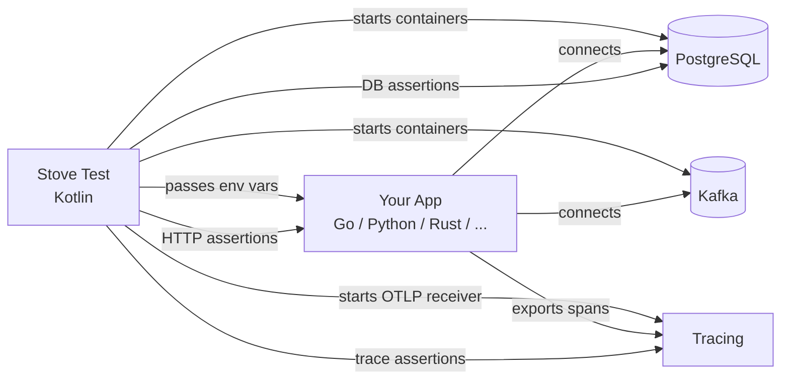

# Other Languages & Stacks

Stove ships with JVM framework starters (Spring Boot, Ktor, Micronaut, Quarkus), but the core testing model isn't limited to JVM applications. You can use Stove to <span data-rn="highlight" data-rn-color="#00968855" data-rn-duration="800">test any application that speaks HTTP, databases, and messaging</span> --- regardless of the language it's written in.

The key: implement a custom `ApplicationUnderTest` that starts your app as an OS process, pass infrastructure configuration via environment variables, and let Stove manage the rest.

## How It Works



Stove starts the infrastructure (databases, message brokers), launches your application as an OS process with the right connection details, and then runs tests against it using the same DSL you'd use for JVM apps.

## Supported Languages

Any language that can:

1. **Read environment variables** --- to receive database URLs, ports, and credentials
2. **Expose an HTTP health endpoint** --- for Stove to know the app is ready
3. **Shut down on SIGTERM** --- for clean test teardown

<div class="grid cards" markdown>

-   :material-language-go: **Go**

    Full walkthrough: HTTP + PostgreSQL + Kafka + OpenTelemetry tracing + Dashboard.

    [Go guide :material-arrow-right:](go.md)

</div>

## At A Glance

| Concern | JVM App (Spring Boot, etc.) | Non-JVM App (Go, Python, etc.) |
|---------|---------------------------|-------------------------------|
| **Application startup** | Framework starter (`springBoot()`, `ktor()`) | Custom `ApplicationUnderTest` via `goApp()`, `nodeApp()`, etc. |
| **Config passing** | JVM system properties / Spring properties | Environment variables via `configMapper` |
| **Infrastructure** | Same (`postgresql {}`, `kafka {}`, `http {}`) | Same |
| **Test DSL** | Same (`stove { http { ... } postgresql { ... } }`) | Same |
| **Tracing** | OTel Java Agent (automatic) | OTel SDK for your language (e.g., `otelhttp`, `otelsql`) |
| **Dashboard** | Same (`dashboard {}`) | Same |
| **Bridge (`using<T> {}`)** | Yes (access DI container) | No (separate process) |

## The Pattern

Every non-JVM integration follows the same three steps:

### 1. Implement `ApplicationUnderTest`

Start your app as an OS process, pass configs as env vars, wait for health check:

```kotlin
class MyAppUnderTest(
    private val binaryPath: String,
    private val port: Int,
    private val configMapper: (List<String>) -> Map<String, String>
) : ApplicationUnderTest<Unit> {

    override suspend fun start(configurations: List<String>) {
        val envVars = configMapper(configurations)
        // Start process, wait for health check
    }

    override suspend fun stop() {
        // Send SIGTERM, wait for graceful shutdown
    }
}
```

### 2. Instrument your app with OpenTelemetry

Use your language's OTel SDK. Stove starts an OTLP gRPC receiver and passes the endpoint via env vars. Your app exports spans to Stove, and Stove correlates them back to the test via W3C `traceparent` headers.

### 3. Write tests with the standard DSL

Tests look identical to JVM tests --- `http {}`, `postgresql {}`, `kafka {}`, `tracing {}`, `dashboard {}` all work the same way.

## What You Can't Do

Since the application runs as a separate OS process:

- **No `bridge()` / `using<T> {}`** --- you can't access the app's internal state or DI container

Everything else works: HTTP assertions, database queries, Kafka publishing and consuming (`shouldBePublished`, `shouldBeConsumed`), tracing, WireMock, gRPC, and the dashboard.

!!! info "Kafka Interceptors for Non-JVM Apps"
    Stove provides bridge libraries that enable `shouldBeConsumed` and `shouldBePublished` assertions for non-JVM applications. The `stove-kafka` Go library supports three popular Kafka clients --- IBM/sarama (interceptors), twmb/franz-go (hooks), and segmentio/kafka-go (helpers) --- and forwards messages via gRPC to Stove's observer. See the [Go guide](go.md#kafka) for details.

## Next Steps

- [Go guide](go.md) --- complete example with Go, PostgreSQL, Kafka, OpenTelemetry, and Dashboard
- [Provided Application](../Components/19-provided-application.md) --- for testing already-deployed apps (black-box)
- [Writing Custom Systems](../writing-custom-systems.md) --- for extending Stove with new component types
