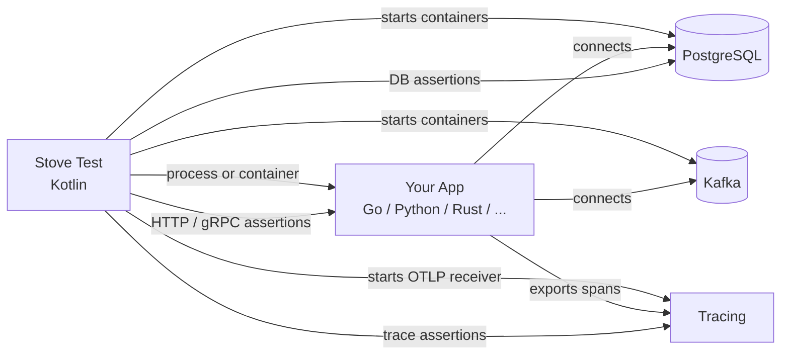

# Other Languages & Stacks

Stove ships with JVM framework starters (Spring Boot, Ktor, Micronaut, Quarkus), but the core testing model isn't limited to JVM applications. You can use Stove to <span data-rn="highlight" data-rn-color="#00968855" data-rn-duration="800">test any application that speaks HTTP, databases, and messaging</span> --- regardless of the language it's written in.

The key choice is *how* the application under test runs:

- **`stove-process`** — start a host binary (`processApp` / `goApp`). Fastest iteration loop. Zero infrastructure beyond your compiler.
- **`stove-container`** — start a Docker image (`containerApp`). CI-grade parity with the artifact you ship to production.

Both expose the same envelope: env-var or CLI-arg config mapping, readiness strategies, graceful shutdown, and the same `stove { http { … } postgresql { … } kafka { … } tracing { … } }` test DSL.

## How It Works



Stove starts the infrastructure (databases, message brokers, OTLP receiver), launches your application as either an OS process or a Docker container with the right connection details, and runs tests against it using the same DSL you'd use for JVM apps.

## Supported Languages

Any language that can:

1. **Read environment variables (or CLI args)** — to receive database URLs, ports, and credentials
2. **Expose a readiness signal** — typically an HTTP `/health` endpoint, but TCP / custom probes / fixed delay are supported
3. **Shut down on SIGTERM** — for clean test teardown (and for things like Go integration coverage flushing)

<div class="grid cards" markdown>

-   :material-language-go: **Go** — first-class

    Full walkthrough across both modes: HTTP + PostgreSQL + Kafka + OpenTelemetry + Dashboard + MCP + integration coverage.

    [Overview :material-arrow-right:](go.md) · [Process Mode :material-arrow-right:](go-process.md) · [Container Mode :material-arrow-right:](go-container.md)

</div>

## Process vs. Container at a glance

| Concern | `stove-process` | `stove-container` |
|---------|----------------|-------------------|
| **Starter** | `goApp()` / `processApp()` | `containerApp()` |
| **AUT artifact** | Host binary | Docker image |
| **Iteration speed** | Fast (compile + run) | Slower (image build) |
| **Production parity** | Approximate (host runtime) | Exact |
| **CI fit** | Smoke / inner loop | Pre-merge / release validation |
| **Networking** | Loopback | Host network *or* port binding |
| **Filesystem isolation** | Host filesystem | Container layer + bind mounts |
| **Common pitfalls** | Glibc/runtime drift hidden | Network mode + port binding wiring |

A common pattern: `e2eTest` uses process mode for daily development, `e2eTest-container` runs container mode in CI. Same Kotlin tests, same StoveConfig, branched only on a `-Dgo.aut.mode=process|container` system property.

## At A Glance vs. JVM apps

| Concern | JVM App (Spring Boot, etc.) | Non-JVM App (Go, Python, etc.) |
|---------|---------------------------|-------------------------------|
| **Application startup** | Framework starter (`springBoot()`, `ktor()`) | `goApp()` / `processApp()` (`stove-process`) or `containerApp()` (`stove-container`) |
| **Config passing** | JVM system properties / Spring properties | `envMapper` / `argsMapper` |
| **Infrastructure** | Same (`postgresql {}`, `kafka {}`, `http {}`) | Same |
| **Test DSL** | Same (`stove { http { ... } postgresql { ... } }`) | Same |
| **Tracing** | OTel Java Agent (automatic) | OTel SDK for your language (e.g., `otelhttp`, `otelsql`) |
| **Dashboard** | Same (`dashboard {}`) | Same |
| **MCP triage** | Same (`stove` CLI, `/mcp`) | Same |
| **Bridge (`using<T> {}`)** | Yes (access DI container) | No (separate process / container) |

## The Pattern

Every non-JVM integration follows the same three steps, regardless of language or mode:

### 1. Choose a starter and wire the AUT

```kotlin
// Process mode
goApp(
    target = ProcessTarget.Server(port = 8090, portEnvVar = "APP_PORT"),
    envProvider = envMapper { /* ... */ }
)

// Container mode
containerApp(
    image = "my-app:local",
    target = ContainerTarget.Server(hostPort = 8090, internalPort = 8090, portEnvVar = "APP_PORT"),
    envProvider = envMapper { /* ... */ },
    configureContainer = { withNetworkMode("host") }
)
```

### 2. Instrument your app with OpenTelemetry

Use your language's OTel SDK. Stove starts an OTLP gRPC receiver and passes the endpoint via env vars. Your app exports spans to Stove, and Stove correlates them back to the test via W3C `traceparent` headers.

### 3. Write tests with the standard DSL

Tests look identical to JVM tests — `http {}`, `postgresql {}`, `kafka {}`, `tracing {}`, `dashboard {}` all work the same way.

## What You Can't Do

Since the application runs as a separate OS process or container:

- **No `bridge()` / `using<T> {}`** — you can't access the app's internal state or DI container

Everything else works: HTTP assertions, database queries, Kafka publishing and consuming (`shouldBePublished`, `shouldBeConsumed`), tracing, WireMock, gRPC, the [Dashboard](../Components/18-dashboard.md), and the [MCP](../Components/21-mcp.md) triage tools.

!!! info "Kafka assertions for non-JVM apps"
    Stove provides bridge libraries that enable `shouldBeConsumed` and `shouldBePublished` assertions for non-JVM applications. The [`stove-kafka`](https://github.com/trendyol/stove/tree/main/go/stove-kafka) Go library supports IBM/sarama (interceptors), twmb/franz-go (hooks), and segmentio/kafka-go (helpers), and forwards messages via gRPC to Stove's observer. The library-agnostic core also lets you wire any other Kafka client (e.g. confluent-kafka-go) yourself.

## Next Steps

- [Go overview](go.md) — pick the right mode for your needs
- [Go Process Mode](go-process.md) — fastest iteration, full HTTP + PG + Kafka + tracing + coverage walkthrough
- [Go Container Mode](go-container.md) — CI-grade parity with the production image
- [Provided Application](../Components/19-provided-application.md) — for testing already-deployed apps (black-box)
- [Dashboard](../Components/18-dashboard.md) — live timeline, traces, snapshots, Kafka explorer
- [MCP](../Components/21-mcp.md) — agent-friendly endpoint for failed-test triage
- [Writing Custom Systems](../writing-custom-systems.md) — extend Stove with new component types
