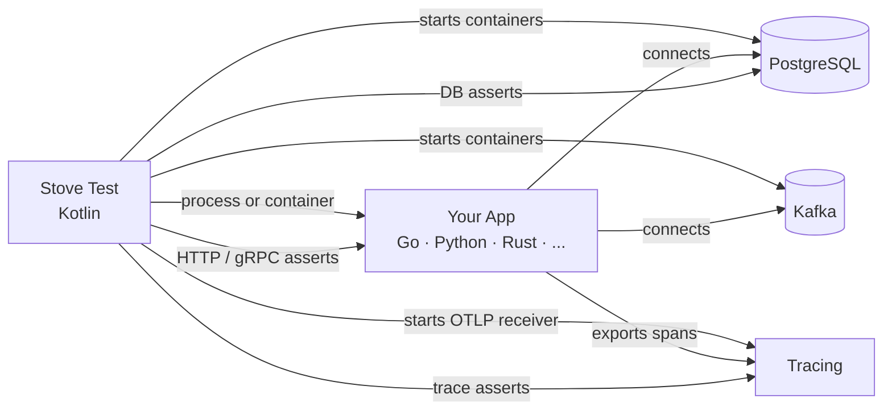

# Polyglot

Stove's testing model isn't JVM-only. Any app that speaks HTTP, databases, and messaging fits. Go, Python, Rust, Node, .NET. Pick how the app starts: as a host binary (fast iteration) or as a Docker image (CI parity).

<div class="stove-tldr" markdown>
<span class="stove-tldr-title">Same DSL, different runner</span>
<code>stove { http { } postgresql { } kafka { } tracing { } }</code> looks identical. Only the AUT runner changes. Bridge is unavailable. Verify through systems.
</div>

## Two ways to run the app

<div class="stove-compare" markdown="0">
  <div>
    <h4>🏃 <code>stove-process</code></h4>
    <p>Run a host binary (<code>goApp()</code> / <code>processApp()</code>). Fastest inner loop. Compile and go.</p>
    <ul>
      <li>Quick to iterate</li>
      <li>Zero infra beyond your compiler</li>
      <li>Approximate prod parity (host runtime)</li>
      <li>Best for dev + smoke tests</li>
    </ul>
  </div>
  <div>
    <h4>🐳 <code>stove-container</code></h4>
    <p>Run any Docker image (<code>containerApp()</code>). CI-grade parity with what you ship.</p>
    <ul>
      <li>Exact production parity</li>
      <li>Image build per run</li>
      <li>Best for pre-merge + release validation</li>
      <li>Language-agnostic</li>
    </ul>
  </div>
</div>

A common pattern: `e2eTest` (process) for dev, `e2eTest-container` for CI. Same Kotlin tests, same `StoveConfig`, branched on `-Dgo.aut.mode=process|container`.

## How it works



Stove launches infra, hands your app the connection details (env vars / CLI args), and runs the standard DSL against it.

## Language requirements

Any language that can:

1. **Read env vars** (or CLI args) for DB URLs, ports, credentials
2. **Expose readiness**. HTTP `/health` (preferred), TCP probe, custom probe, fixed delay
3. **Handle SIGTERM**. For clean teardown and Go integration coverage flush

## Languages we walk through

<div class="stove-catalog">
  <div class="stove-sys-card">
    <div class="stove-sys-card-head"><strong>Go</strong><span class="stove-sys-card-badge">First-class</span></div>
    <p class="stove-sys-card-desc">HTTP · Postgres · Kafka (sarama / franz-go / segmentio) · OTel · Dashboard · MCP · integration coverage.</p>
    <div class="stove-sys-card-actions">
      <a href="go/">Overview</a>
      <a href="go-process/">Process mode</a>
      <a href="go-container/">Container mode</a>
    </div>
  </div>
</div>

Python, Rust, Node, .NET follow the same shape. Pick `processApp` (or `containerApp`) and your language's OTel SDK. Open an issue if you want a dedicated walkthrough.

## Process vs container at a glance

| Concern | `stove-process` | `stove-container` |
|---|---|---|
| Starter | `goApp()` / `processApp()` | `containerApp()` |
| AUT artifact | Host binary | Docker image |
| Iteration speed | Fast (compile + run) | Slower (image build) |
| Production parity | Approximate | Exact |
| CI fit | Smoke / inner loop | Pre-merge / release |
| Networking | Loopback | Host network *or* port binding |
| Filesystem isolation | Host filesystem | Container layer + bind mounts |
| Common pitfalls | Runtime drift hidden | Network mode + port wiring |

## vs JVM apps

| Concern | JVM app | Non-JVM app |
|---|---|---|
| AUT startup | `springBoot()`, `ktor()`, ... | `goApp()` / `processApp()` / `containerApp()` |
| Config | JVM properties | `envMapper` / `argsMapper` |
| Infra | Same (`postgresql { }`, `kafka { }`, ...) | Same |
| Test DSL | Same | Same |
| Tracing | OTel Java Agent (auto) | OTel SDK for your language |
| Dashboard / MCP | Same | Same |
| Bridge `using<T> { }` | ✓ | ✗ (separate process / container) |

## The pattern

### 1. Wire the AUT

```kotlin
// Process mode
goApp(
  target = ProcessTarget.Server(port = 8090, portEnvVar = "APP_PORT"),
  envProvider = envMapper { /* ... */ }
)

// Container mode
containerApp(
  image = "my-app:local",
  target = ContainerTarget.Server(hostPort = 8090, internalPort = 8090, portEnvVar = "APP_PORT"),
  envProvider = envMapper { /* ... */ },
  configureContainer = { withNetworkMode("host") }
)
```

### 2. Instrument with OpenTelemetry

Enable the **`stoveTracing` Gradle plugin**. It boots the OTLP gRPC receiver, picks a free port, and exposes it to your tests + AUT via env vars:

```kotlin hl_lines="2 5 6 7"
plugins {
    id("com.trendyol.stove.tracing") version "$stoveVersion"
}

stoveTracing {
    serviceName.set("my-service")
    testTaskNames.set(listOf("e2eTest"))   // and "e2eTest-container", etc.
}
```

Then instrument your app with your language's OTel SDK. Stove correlates spans back to the test via W3C `traceparent`. JVM apps get the agent attached automatically; non-JVM apps just need to read the OTLP endpoint from the standard env vars.

### 3. Write tests with the standard DSL

`http { }`, `postgresql { }`, `kafka { }`, `tracing { }`, `dashboard { }`. Identical to JVM tests.

## What you can't do

- :x: **No `bridge()` / `using<T> { }`**. Different process / container.

Everything else works: HTTP/gRPC, DB queries, Kafka assertions (`shouldBePublished`, `shouldBeConsumed`), tracing, WireMock, Dashboard, MCP.

!!! info "Kafka assertions for non-JVM apps"
    Stove ships bridge libraries to expose `shouldBeConsumed` / `shouldBePublished` for non-JVM apps. The [`stove-kafka`](https://github.com/trendyol/stove/tree/main/go/stove-kafka) Go library supports IBM/sarama (interceptors), twmb/franz-go (hooks), and segmentio/kafka-go (helpers). The library-agnostic core lets you wire any other client (e.g. confluent-kafka-go).

## Next

- [Go overview](go.md). Pick the right mode for your project
- [Go Process Mode](go-process.md). Full walkthrough (HTTP + PG + Kafka + OTel + coverage)
- [Go Container Mode](go-container.md). Production-image parity
- [Provided Application](../Components/19-provided-application.md). Already-deployed apps (black-box)
- [Dashboard](../Components/18-dashboard.md) · [MCP](../Components/21-mcp.md). Observability
- [Custom systems](../writing-custom-systems.md). Extend Stove
