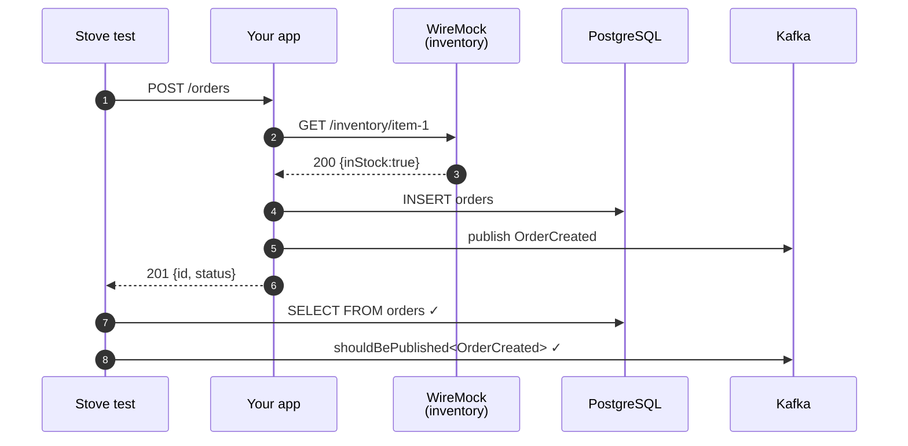

# Recipe: Order Placement Flow

Test a complete order placement: client calls `POST /orders`, app validates inventory through a third-party HTTP service, persists the order, then publishes an `OrderCreated` event to Kafka. All four surfaces (HTTP in, HTTP out, DB, Kafka out) covered in one test.

<a class="open-in-wizard" data-sys="http,postgresql,kafka" data-mk="wiremock" data-fw="spring-boot">Open this setup in the wizard</a>

## Systems used

| Surface | System | Why |
|---|---|---|
| HTTP in | [HTTP Client](../Components/05-http.md) | drive the app like a real client |
| HTTP out | [WireMock](../Components/04-wiremock.md) | mock the inventory service |
| Persistence | [PostgreSQL](../Components/06-postgresql.md) | verify the order row |
| Messaging | [Kafka](../Components/02-kafka.md) | assert the `OrderCreated` event |

Optional but recommended: [Tracing](../Components/15-tracing.md) and [Dashboard](../Components/18-dashboard.md). When this test fails you'll get a full call chain + timeline.

## What success looks like



## Gradle dependencies

```kotlin
plugins {
    id("com.trendyol.stove.tracing") version "$stoveVersion"
}

stoveTracing {
    serviceName.set("order-service")
    testTaskNames.set(listOf("e2eTest"))
}

dependencies {
    testImplementation(platform("com.trendyol:stove-bom:$stoveVersion"))
    testImplementation("com.trendyol:stove")
    testImplementation("com.trendyol:stove-spring")
    testImplementation("com.trendyol:stove-extensions-kotest")
    testImplementation("com.trendyol:stove-http")
    testImplementation("com.trendyol:stove-postgres")
    testImplementation("com.trendyol:stove-kafka")
    testImplementation("com.trendyol:stove-wiremock")
    testImplementation("com.trendyol:stove-tracing")
    testImplementation("com.trendyol:stove-dashboard")
}
```

## `StoveConfig.kt`

```kotlin
package com.yourcompany.orders.e2e.setup

import com.trendyol.stove.testing.e2e.Stove
import com.trendyol.stove.testing.e2e.http.HttpClientSystemOptions
import com.trendyol.stove.testing.e2e.http.httpClient
import com.trendyol.stove.testing.e2e.dashboard.*
import com.trendyol.stove.testing.e2e.database.postgresql.*
import com.trendyol.stove.testing.e2e.messaging.kafka.*
import com.trendyol.stove.testing.e2e.serialization.StoveSerde
import com.trendyol.stove.testing.e2e.springBoot
import com.trendyol.stove.testing.e2e.standalone.kotest.AbstractProjectConfig
import com.trendyol.stove.testing.e2e.standalone.kotest.StoveKotestExtension
import com.trendyol.stove.testing.e2e.tracing.tracing
import com.trendyol.stove.testing.e2e.wiremock.*
import io.kotest.core.extensions.Extension

class StoveConfig : AbstractProjectConfig() {
    override val extensions: List<Extension> = listOf(StoveKotestExtension())

    override suspend fun beforeProject() {
        Stove().with {
            httpClient { HttpClientSystemOptions(baseUrl = "http://localhost:8080") }

            tracing { enableSpanReceiver() }
            dashboard { DashboardSystemOptions(appName = "order-service") }

            wiremock {
                WireMockSystemOptions(
                    port = 0,
                    configureExposedConfiguration = { cfg ->
                        listOf("clients.inventory.url=${cfg.baseUrl}")
                    }
                )
            }

            postgresql {
                PostgresqlOptions(
                    databaseName = "orders",
                    configureExposedConfiguration = { cfg ->
                        listOf(
                            "spring.datasource.url=${cfg.jdbcUrl}",
                            "spring.datasource.username=${cfg.username}",
                            "spring.datasource.password=${cfg.password}"
                        )
                    }
                )
            }

            kafka {
                KafkaSystemOptions(
                    serde = StoveSerde.jackson.anyByteArraySerde(),
                    configureExposedConfiguration = { cfg ->
                        listOf(
                            "spring.kafka.bootstrap-servers=${cfg.bootstrapServers}",
                            "spring.kafka.producer.properties.interceptor.classes=${cfg.interceptorClass}",
                            "spring.kafka.consumer.properties.interceptor.classes=${cfg.interceptorClass}"
                        )
                    }
                )
            }

            springBoot(
                runner = { params ->
                    com.yourcompany.orders.run(params) {
                        addTestDependencies {
                            bean { StoveSerde.jackson.anyByteArraySerde() }
                        }
                    }
                },
                withParameters = listOf("server.port=8080")
            )
        }.run()
    }

    override suspend fun afterProject() = Stove.stop()
}
```

## The test

```kotlin
class OrderFlowE2ETest : FunSpec({
  test("POST /orders creates row and publishes OrderCreated") {
    val userId = "user-${UUID.randomUUID()}"
    val itemId = "item-1"

    stove {
      wiremock {
        mockGet(
          url = "/inventory/$itemId",
          statusCode = 200,
          responseBody = InventoryResponse(inStock = true).some()
        )
      }

      http {
        postAndExpectBody<OrderResponse>(
          uri = "/orders",
          body = CreateOrderRequest(userId, itemId, quantity = 1).some()
        ) { response ->
          response.status shouldBe 201
          response.body().orElseThrow().status shouldBe "CREATED"
        }
      }

      postgresql {
        shouldQuery<OrderRow>(
          query = "SELECT id, user_id, status FROM orders WHERE user_id = '$userId'",
          mapper = { row -> OrderRow(row.string("id"), row.string("user_id"), row.string("status")) }
        ) { rows ->
          rows shouldHaveSize 1
          rows.first().status shouldBe "CREATED"
        }
      }

      kafka {
        shouldBePublished<OrderCreated> {
          actual.userId == userId && actual.itemId == itemId
        }
      }
    }
  }
})
```

## Variations

=== "Ktor"

    Replace the runner block:

    ```kotlin
    ktor(
        runner = { params -> com.yourcompany.orders.run(params, wait = false) },
        withParameters = listOf("server.port=8080")
    )
    ```

=== "Micronaut"

    ```kotlin
    micronaut(
        runner = { params -> com.yourcompany.orders.run(params) },
        withParameters = listOf("micronaut.server.port=8080")
    )
    ```

=== "Quarkus"

    ```kotlin
    quarkus(
        runner = { params -> com.yourcompany.orders.main(params) },
        withParameters = listOf("quarkus.http.port=8080")
    )
    ```

=== "Go (process mode)"

    Replace `stove-spring` with `stove-process`, configure Kafka via the [Go bridge](../other-languages/go.md), and use:

    ```kotlin
    goApp {
        GoAppOptions(
            sourcePath = "../app",
            readiness = ReadinessStrategy.HttpGet(url = "http://localhost:8080/health")
        )
    }
    ```

## Common pitfalls

!!! warning "Kafka assertion times out"
    Default Kafka client settings are tuned for throughput, not test speed. Set `linger.ms=0`, `batch.size=1`, `auto-offset-reset=earliest`. See [Kafka test-friendly settings](../Components/02-kafka.md).

!!! warning "WireMock stub never matches"
    Your app's external URL must point to WireMock. Use the `configureExposedConfiguration` lambda to inject `clients.inventory.url=${cfg.baseUrl}` and verify the app reads that property.

!!! warning "Database row not found"
    Confirm the table name matches your migrations. If you use Flyway, register migrations in `PostgresqlOptions.migrations { register<InitialMigration>() }`.

!!! tip "Diagnosing failures"
    With tracing + dashboard on, a failure shows the full call chain. See [When a test fails](../observability/when-it-fails.md).
