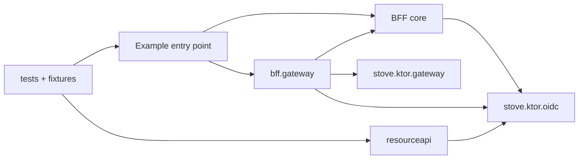

# Ktor OIDC BFF on GraalVM

A small browser-facing Kotlin application with a real OpenID Connect authorization-code flow. It runs on the JVM or as a GraalVM native executable. Stove provides an OIDC issuer during tests; the application itself has no Stove dependency.

The BFF uses Ktor CIO for both its server and HTTP client, kotlinx JSON for protocol messages, and Nimbus JOSE for RS256 ID-token verification. The browser receives an opaque session cookie. Access tokens, refresh tokens, and optional DPoP keys remain in the BFF, which uses them to fetch the signed-in user's profile and, when configured, orders from a downstream API.

[Before/after-forward hooks](#custom-logic) run request logic and transform upstream responses inside a configured proxy route; forwarding, authentication, refresh, and DPoP remain automatic. [Custom Ktor handlers](#custom-endpoints) can also aggregate upstream calls and shape browser responses. The example adds an order summary and a confirmation command while other orders paths keep proxying through configuration.

This README is the single maintained guide for this example. Keep usage, architecture, protocol, storage, and testing documentation here.

## Contents

- [Try it with Keycloak](#try-it-with-keycloak)
- [Build and run a native executable](#build-and-run-a-native-executable)
- [Configuration](#configuration)
- [Request flow](#request-flow)
- [Ktor OIDC integration](#ktor-oidc-integration)
- [Configurable BFF gateway](#configurable-bff-gateway)
- [Browser session storage](#browser-session-storage)
- [DPoP in the Ktor BFF](#dpop-in-the-ktor-bff)
- [Source layout](#source-layout)
- [Test with Stove](#test-with-stove)
- [Deliberate example boundaries](#deliberate-example-boundaries)

## Try it with Keycloak

From the repository root, with [just](https://github.com/casey/just), curl, Docker, and the repository's Java toolchain installed:

```shell
just bff run
```

This starts Keycloak, waits for its discovery endpoint, and runs the app in the foreground. Use `just bff` for all shortcuts, or change into the example directory and use `just run`.

Open <http://localhost:8080>, choose **Sign in**, and log in with **alice / alice**. These are local example credentials. The imported realm registers a confidential client, an exact callback URL, mandatory S256 PKCE, thirty-second access tokens, and refresh-token rotation. After signing in, wait thirty seconds and select **Reload profile**: the BFF refreshes automatically while the browser keeps the same cookie.

To enable DPoP, start the app with:

```shell
just bff run-dpop
```

The local realm permits both bearer and DPoP clients. To require DPoP at the provider too, set the client's `dpop.bound.access.tokens` attribute to `true`; the Keycloak test fixture enforces this. Realm JSON changes require recreating the local example container to import them.

Stop the app with Ctrl+C. Remove the example's Keycloak container when finished:

```shell
just bff down
```

## Build and run a native executable

Install GraalVM JDK 25 with `native-image`, plus the platform C compiler (Xcode Command Line Tools on macOS; GCC and the usual native-image development libraries on Linux). Set `GRAALVM_HOME` to that installation. The native executable is specific to the build machine's operating system and architecture.

```shell
GRAALVM_HOME=/path/to/graalvm just bff run-native-dpop
```

This starts Keycloak, builds the executable, and runs it with DPoP. Use `run-native` for bearer tokens or `native` to build without starting anything. The native build includes the web assets, enables HTTPS client support, and uses GraalVM reachability metadata. The native plugin is supplied by this repository's shared build; a standalone copy should declare `org.graalvm.buildtools.native` version `1.1.2` explicitly.

## Configuration

Set environment variables or pass `--KEY=value` arguments; arguments take precedence.

| Key | Default | Meaning |
|---|---|---|
| `PORT` | `8080` | Server listen port |
| `BFF_ORIGIN` | `http://localhost:$PORT` | Public browser origin; determines callback URL and Secure cookie flag |
| `OIDC_ISSUER` | `http://localhost:8081/realms/stove` | Exact issuer from discovery |
| `OIDC_CLIENT_ID` | `stove-bff` | Confidential OIDC client |
| `OIDC_CLIENT_SECRET` | `bff-example-secret` | Local example client secret |
| `OIDC_DPOP` | `false` | Require ES256 DPoP token binding for this BFF |
| `RESOURCE_API_URL` | Unset | Convenience default: enables `/orders/**` and `/api/orders/**`, requests `orders:read` |
| `BFF_ROUTES_FILE` | Unset | JSON service/route configuration; replaces the convenience default and is loaded at startup |

For another provider, register `$BFF_ORIGIN/auth/callback`, enable authorization code with S256 PKCE and `client_secret_post`, and issue RS256 ID tokens. Discovery must expose authorization, token, JWKS, and UserInfo endpoints. Use HTTPS outside local development; when TLS terminates at a proxy, set `BFF_ORIGIN` to the public HTTPS origin and keep the BFF reachable only through the proxy. The BFF listens on `0.0.0.0`.

## Request flow

```mermaid
sequenceDiagram
    participant Browser
    participant BFF as Ktor BFF
    participant IdP as OIDC provider
    Browser->>BFF: GET /auth/login
    BFF-->>Browser: Login cookie + redirect (state, nonce, S256 challenge)
    Browser->>IdP: Authorize and sign in
    IdP-->>Browser: Redirect with code and state
    Browser->>BFF: GET /auth/callback + login cookie
    BFF->>IdP: Exchange code + client secret + PKCE verifier
    IdP-->>BFF: Access token + ID token + refresh token
    BFF->>IdP: Fetch signing keys
    Note over BFF: Verify ID token; create server session
    BFF-->>Browser: HttpOnly session cookie + redirect home
    Browser->>BFF: GET /api/profile + session cookie
    opt Access token expires soon
        BFF->>IdP: Refresh grant + client authentication (+ DPoP proof)
        IdP-->>BFF: New access token + rotated refresh token
    end
    BFF->>IdP: UserInfo + access token (+ DPoP proof)
    IdP-->>BFF: Profile claims
    BFF-->>Browser: Selected profile fields
```

## Ktor OIDC integration

The reusable Ktor integration lives in [`stove.ktor.oidc`](src/main/kotlin/stove/ktor/oidc/). It has no dependency on BFF configuration, browser routes, orders, or Stove. It remains source code within this example, rather than a separately published artifact. The BFF composes it with application-specific login and session services.

### Built-in Ktor OIDC compatibility

This example does **not** use `ktor-server-auth-oidc`. Ktor's [built-in OIDC plugin](https://ktor.io/docs/server-oidc.html) implements discovery, authorization-code login, S256 PKCE, state, nonce, and ID-token verification. It is a candidate for replacing the corresponding services here, but its **3.6.0** API cannot preserve all of this example's behavior.

The compatibility review used the published [3.6.0 JVM sources](https://repo.maven.apache.org/maven2/io/ktor/ktor-server-auth-oidc-jvm/3.6.0/ktor-server-auth-oidc-jvm-3.6.0-sources.jar):

| Requirement | Ktor 3.6.0 behavior | Consequence |
|---|---|---|
| DPoP-bound login | `OidcTokens.kt` calls `requireBearerTokenType` during `buildOAuthToken`. | A valid `token_type=DPoP` response is rejected, even if a supplied HTTP client adds the correct proof. |
| DPoP-bound refresh | `refreshTokenInternal` requires Bearer when the response includes an ID token. | Refresh behavior cannot support all valid DPoP responses. |
| Access-token expiry | `onAuthenticated` receives `OidcToken.Id`, which contains tokens and identity claims but no access-token `expires_in` or `token_type`. | The session cannot schedule refresh from the token endpoint's lifetime through this callback. ID-token expiry is not a substitute; access tokens may also be opaque. |
| Shared session ownership | `disableSessions()` and `onAuthenticated` allow application-owned sessions. The provider's refresh coalescing is process-local. | Our storage contract and distributed refresh claims would still be needed after migration. |

The built-in plugin remains an option for standard Bearer flows. Missing access-token metadata is an integration gap potentially bridgeable through HTTP client interception; the explicit Bearer validation is the blocker for directly migrating DPoP flows. This example retains its current protocol services. Do not rewrite DPoP responses as Bearer to bypass validation. A future migration must also retain server-side one-time login consumption, cross-pod DPoP key recovery, and the refresh/logout race guarantees. Validate it against NAV and Keycloak with both session stores on JVM and GraalVM; these findings are source-verified, not an executable compatibility test, and the built-in plugin's native-image compatibility has not been established.

### Outgoing requests

Install [`OidcAuthentication`](src/main/kotlin/stove/ktor/oidc/client/OidcAuthentication.kt) once on a shared client. Select the session's binding and credentials on each request:

```kotlin
val http = HttpClient(CIO) {
  install(OidcAuthentication)
  install(HttpTimeout) { requestTimeoutMillis = 5000 }
  followRedirects = false
}

http.patch("https://api.example/documents/42") {
  oidcResource(session.binding) { provider.accessToken(session) }
  setBody(document)
}

http.submitForm(tokenEndpoint, grantParameters) {
  oidcToken(session.binding)
}
```

`oidcResource` accepts a suspending token supplier. The BFF supplier coordinates refresh and rotation through an atomic claim in the session store. It runs once per logical request; a nonce retry uses the same resolved token. Credentials are stored in request attributes, so concurrent sessions do not share tokens. Requests without either helper receive no authentication from the plugin.

The plugin uses Ktor's `SendingRequest` hook to create a fresh proof for every actual send, using its method and URL. `Send` observes nonce challenges and allows one retry. Only replayable bodies (no content or byte-array content, including forms and text) are retried. Streaming uploads return the challenge to the caller without inspecting or buffering its body. Inspected error bodies remain readable. Nonce-challenge inspection is capped at 64 KiB, including when the caller streams responses.

If redirects are enabled, resource credentials can follow redirects within the original origin; proofs are regenerated for the destination. Cross-origin redirects are rejected before transmission. Token grants cannot redirect to another URL, including another path on the same origin. Applications should avoid layering automatic retries over token grants: consuming a rotating refresh credential has an uncertain outcome after a transport failure.

[`TokenBinding.Dpop`](src/main/kotlin/stove/ktor/oidc/client/TokenBinding.kt) owns a session's key and endpoint nonces. `TokenBinding.Bearer` uses the same request API without proofs. Configure the HTTP engine, timeout, TLS policy, and client lifecycle at the application's composition boundary.

### Resource-server authentication and scopes

Use Ktor's `Authentication` plugin and the `oidc` provider. Token validation is an injected suspending function; the supplied [`AccessTokenVerifier`](src/main/kotlin/stove/ktor/oidc/server/AccessTokenVerifier.kt) implements RS256 JWT verification with configured issuer, audience, and keys.

```kotlin
install(Authentication) {
  oidc("access") {
    verifyAccessToken = verifier::verify
    requireDpop = true
    targetUri = { call -> "$publicOrigin${call.request.path()}" }
  }
}

routing {
  authenticate("access") {
    requireScopes("access", "documents:read") {
      get("/documents") {
        val identity = checkNotNull(call.principal<VerifiedAccessToken>("access"))
        call.respondText("Documents for ${identity.subject}")
      }
    }
  }
}
```

`publicOrigin` must come from trusted deployment configuration and match the URL clients sign. Resolve any externally visible path prefix there too. Do not derive it from an unvalidated `Host` or forwarded header. Query parameters and fragments are excluded. The test resource API uses its bound connector's origin.

The provider validates credentials and registers a principal or authentication challenge with Ktor. A bound token always requires its matching DPoP proof, including when `requireDpop` is false. Failures return `401` with the appropriate Bearer or DPoP challenge. Scope authorization runs at `AuthenticationChecked`, before handlers. Missing scopes return `403`; missing principals fail closed. Nested `requireScopes` blocks accumulate requirements instead of overriding the parent policy.

[`DpopVerifier`](src/main/kotlin/stove/ktor/oidc/server/DpopVerifier.kt) validates signatures, token binding, request binding, freshness, and replay. Its suspending `ProofReplayStore` dependency can be replaced with an atomic shared implementation; the default cache is bounded and process-local. The example loads JWKS at startup. A deployment requiring key rotation should supply a verifier with a refreshable trusted key source.

### Browser sessions and CSRF

[`BrowserAuthentication`](src/main/kotlin/stove/ktor/bff/auth/BrowserAuthentication.kt) configures Ktor `Sessions` and `session<BrowserCookie>("browser")`. Cookies contain only opaque random IDs with explicit serializers, so tokens stay in the server's store and native images do not require reflective cookie serialization. Cookie expiry is not extended on reads. Validation retrieves an active session and exposes an `AuthenticatedBrowser` principal.

Protected routes live under `authenticate("browser")`. [`SessionCsrf`](src/main/kotlin/stove/ktor/oidc/server/SessionCsrf.kt) is a route plugin installed inside that block. It validates the configured origin and session-specific CSRF header for unsafe methods, before handlers execute. Authentication failures and refresh failures are translated by `StatusPages`.

Authorization-code exchange, state consumption, S256 PKCE, nonce and ID-token validation remain explicit in the login service for the [compatibility reasons above](#built-in-ktor-oidc-compatibility). The [session store](#browser-session-storage) and refresh state machine are application services. Memory and PostgreSQL adapters share the same atomic contract; PostgreSQL uses Exposed and Flyway. Cookie validation consults shared storage, while token rotation uses an expiring versioned claim and revocation reaches other pods through polling.

### Gateway composition

The [BFF gateway](#configurable-bff-gateway) compiles named services and subtree bindings from Kotlin or JSON. Its plugin owns a shared CIO client and takes an application-supplied `GatewayAccess` adapter. Mounted routes inherit `Authentication` and `SessionCsrf`; outgoing calls use `oidcResource` after URL rewriting, so proofs bind the actual upstream URL and method. `StatusPages` handles method, size, transport, and timeout failures before response headers are committed; later streaming failures abort the transfer. The forwarding code has no dependency on `stove.ktor.oidc`. The BFF’s `gateway/GatewayOidc.kt` installs `OidcAuthentication` through `GatewayConfig.client` and implements `GatewayAccess`; the gateway closes that managed client at shutdown.

SSE and WebSocket handshakes use the same adapter. DPoP canonicalizes WS(S) destinations to the actual HTTP(S) upgrade URI. A bodyless rejected upgrade can retry one nonce challenge; rejected upgrade content is read as bounded HTTP bytes, bypassing Ktor’s WebSocket session body transformation. An established connection has no new token requests. The adapter’s revocation callback wakes on session termination or absolute expiry, while successful refresh leaves it pending. See [gateway lifetime policies](#authentication-and-lifetime).

## Configurable BFF gateway

The gateway is optional. Core [BffModule.kt](src/main/kotlin/stove/ktor/bff/BffModule.kt) owns login, callback, logout, profile, browser sessions and CSRF protection. It has no gateway dependency. A custom-route-only BFF can use it directly:

```kotlin
bff(configuration, provider, storage) {
  get("/api/dashboard") {
    call.respondText(dashboardService.load())
  }
}
```

`customRoutes` run inside browser authentication and CSRF protection; the host owns the supplied provider and storage and closes them after server shutdown. Add OAuth scopes through `BffConfiguration.additionalScopes` or the space-separated `OIDC_SCOPES` setting. Core configuration never loads forwarding files.

For forwarding, opt into [BffGateway.kt](src/main/kotlin/stove/ktor/bff/gateway/BffGateway.kt):

```kotlin
val forwarding = BffGatewayConfiguration(gatewayRoutes {
  service("orders", "http://orders.internal:8080") {
    scopes("orders:read")
    route("/api/orders/**") { upstreamPath = "/orders" }
  }
})

bffWithGateway(configuration, provider, storage, forwarding) {
  // Custom authenticated routes can use gatewayRequest, or call application services.
}
```

The integration installs the gateway, connects session tokens/refresh/DPoP, mounts routes under the core security boundary, and adds service scopes to login requests. This works even if `provider` was created before `forwarding`. Forwarding configuration rejects routes that overlap reserved BFF endpoints; `bffWithGateway` requires at least one binding. Both entry points accept an `errors` block using Ktor's `StatusPagesConfig` for application exception handlers.

The example's `startBff` selects `bffWithGateway` when `BFF_ROUTES_FILE` or `RESOURCE_API_URL` supplies bindings, and `bff` otherwise. Example order handlers are mounted only when both `/api/orders/**` and `/orders/**` bindings exist. All code stays in this example module; `bff/gateway` is the optional integration folder and `stove/ktor/gateway` remains the independent transport implementation.


The BFF binds browser-facing path subtrees to named upstream services. Adding an orders endpoint no longer requires an `OrdersClient` method or a BFF route handler. The design borrows the service/route separation from API gateways: services describe destinations, routes describe the browser contract, and Ktor plugins enforce shared policies.

```text
Browser cookie → Session authentication → CSRF for writes → Path binding
                                                               ↓
Resource API ← Access token + fresh DPoP proof ← Refresh ← beforeForward

Resource API → Response headers → afterForward → Stream body to browser
```

Routing is compiled at startup from a Kotlin DSL or JSON file. Changing the file requires restarting the BFF. Request and response bodies stream through Ktor channels with backpressure. The gateway copies small chunks and never collects the whole payload by default, including when hooks are installed. Application-owned Ktor handlers provide custom endpoints. HTTP, SSE and WebSocket transports have separate policies. Live reload, load balancing and token exchange remain outside this example. The reusable code stays in this example’s `stove/ktor/gateway` folder; it has no BFF, OIDC, orders or Stove dependency. See [the source boundaries](#source-boundaries).

### Define services and routes in Kotlin

```kotlin
import io.ktor.http.HttpMethod
import stove.ktor.gateway.gatewayRoutes
import kotlin.time.Duration.Companion.seconds

val routes = gatewayRoutes {
  service("orders", "http://orders.internal:8080/v2") {
    scopes("orders:read", "orders:write")
    route("/orders/**") {
      upstreamPath = "/orders"
      methods = setOf(HttpMethod.Get, HttpMethod.Post, HttpMethod.Patch)
      timeout = 3.seconds
    }
    route("/api/orders/**") { upstreamPath = "/orders" }
  }
  service("catalog", "http://catalog.internal:8080") {
    scopes("catalog:read")
    route("/catalog/**") { upstreamPath = "/inventory" }
  }
}
```

Pass this table as `BffConfiguration.routes` when composing the application. The table snapshots the builder's configuration before the server starts.

| Browser request | Upstream request |
|---|---|
| `GET /orders` | `GET http://orders.internal:8080/v2/orders` |
| `POST /orders/42/items` | `POST http://orders.internal:8080/v2/orders/42/items` |
| `GET /api/orders/42?q=paid` | `GET http://orders.internal:8080/v2/orders/42?q=paid` |
| `GET /catalog/widget` | `GET http://catalog.internal:8080/inventory/widget` |
| `POST /catalog/widget` | `405 Method Not Allowed`; the default policy permits GET and HEAD |
| `GET /orders-other/42` | `404`; a binding matches a complete path segment |

`/**` includes the prefix itself and descendants. `upstreamPath` replaces the browser prefix and defaults to that prefix. An upstream URL can include a base path, which is prepended to `upstreamPath`. Encoded suffixes and query parameters, including repeated values, are retained. Traversal, encoded separators, double decoding, and fragments are rejected.

More specific prefixes take precedence: `/orders/archive/**` can bind a different service while `/orders/**` handles the remaining subtree. Its method policy applies independently; a rejected method does not fall back to the broader route.

### Configure without recompiling

Use [gateway.routes.example.json](gateway.routes.example.json) as a starting point. It expresses the same service/route model and is validated by the same builders.

```shell
# From the repository root, with your compatible APIs already running:
ORDERS_API_URL=http://localhost:8090 \
CATALOG_API_URL=http://localhost:8091 \
BFF_ROUTES_FILE="$PWD/examples/ktor-oidc-bff/gateway.routes.example.json" \
just bff run-dpop
```

The provider must issue tokens with the configured scopes and audiences accepted by those APIs. The bundled browser-demo realm needs those API permissions added before using this sample configuration. The native run shortcuts accept the same environment variables.

`${VARIABLE}` references in `upstream` are resolved from environment variables and command-line settings. Missing variables, unknown fields, duplicate service names or path prefixes, malformed destinations, invalid policies, and bindings overlapping the BFF's own endpoints fail at startup. Literal upstream URLs also work. Service names identify configuration entries; they do not perform service discovery.

When `BFF_ROUTES_FILE` is set, it supplies the entire table. Without it, setting `RESOURCE_API_URL` enables the example's `/orders/**` and `/api/orders/**` bindings and requests `orders:read`. With neither setting (or an empty service table), the profile demo uses core `bff(...)`: no gateway plugin, client, routes or WebSocket plugin is installed.

### Custom logic

Use `beforeForward` for request logic and `afterForward` for response logic while the gateway owns forwarding. Add them to the existing route definition:

```kotlin
val routes = gatewayRoutes {
  service("orders", "http://orders.internal:8080") {
    route("/api/orders/**") {
      upstreamPath = "/orders"
      beforeForward {
        val orderId = call.request.queryParameters["orderId"].orEmpty()
        if (!orderPolicy.canAccess(orderId)) {
          reject(HttpStatusCode.Forbidden, "Order access denied")
        }
        audit.recordOrderAccess(orderId)
      }
      afterForward {
        audit.recordOrderResponse(uri, response.status.value)
      }
    }
  }
}
```

`orderPolicy` and `audit` are application services captured from the surrounding scope; their methods may suspend. Returning normally from `beforeForward` forwards automatically; returning from `afterForward` sends the resulting response. You do not call `gatewayRequest`, `respondGateway`, or `next`, construct a client, or handle tokens in either hook.

For bindings loaded from JSON, attach the same logic at startup without repeating their destination or transport policies:

```kotlin
startBff(args, gateway = {
  beforeForward("/api/orders/**") {
    audit.recordOrderAccess(uri)
  }
  afterForward("/api/orders/**") {
    audit.recordOrderResponse(uri, response.status.value)
  }
})
```

`Application.bffWithGateway` accepts the same `gateway` block. When installing `Gateway` directly, set `hooks = GatewayHooks().apply { beforeForward("/api/orders/**") { /* application logic */ } }`.

Both hooks receive `call` for the authenticated principal, parameters, application dependencies, and Ktor responses; `uri` and `method` identify the incoming request. Use `call.attributes` to share per-request state between phases.

In `beforeForward`, `request.headers` and `request.body` represent the outgoing request. Changing headers does not consume its body. To deserialize, change, and serialize the complete body, explicitly call `readBytes(maxBytes = ...)`; the effective buffer limit is the smaller of this value and the route's limit. Use this API instead of consuming `call.receive*` again:

```kotlin
beforeForward {
  request.headers["Idempotency-Key"] = commandId
  val bytes = request.body.readBytes(maxBytes = 64 * 1024)
  request.textBody(enrich(bytes.decodeToString()), ContentType.Application.Json)
}
```

In `afterForward`, `response.status` and `response.headers` are mutable, and `response.body` is a stream. Header/status-only hooks run as soon as upstream headers arrive. Whole-body processing is opt-in:

```kotlin
afterForward {
  if (response.status == HttpStatusCode.OK) {
    val bytes = response.body.readBytes(maxBytes = 64 * 1024)
    val orders = Json.decodeFromString<OrdersResponse>(bytes.decodeToString())
    val browserOrders = orderViews.toBrowser(orders)
    response.textBody(Json.encodeToString(browserOrders), ContentType.Application.Json)
  }
}
```

`OrdersResponse`, the browser DTO, and `orderViews` belong to the application; DTOs use kotlinx serialization's `@Serializable`. `readBytes` retains a bounded snapshot for later forwarding and returns a copy: reading alone preserves the response. Apply changes with `textBody`, `bytesBody`, or `streamBody(channel, contentLength)`. Both request and response builders support these methods. A stream has one consumer; use the explicit snapshot when multiple operations need its contents.

Body bytes retain the upstream encoding, so decode compressed content before interpreting it as text. Replacing the response body removes stale encoding, validators, ranges, and digest headers. Set any new representation metadata after replacement. The gateway reapplies header allowlists and uses the new body's known length, or chunked transfer when length is unknown. HEAD and `304` preserve representation metadata; `204` and `205` suppress bodies. Hooks cannot produce informational responses or redirects other than `304` through the response builder.

In either phase, `reject(status, message)` stops with the BFF's error response. Calling a normal Ktor response function such as `call.respondText(...)` also skips remaining hooks and the automatic response. A direct Ktor response owns its headers, size, and schema. Exceptions and cancellation propagate to the application's usual handling. Each request gets its own mutable state; captured services must support concurrent calls.

Authentication, CSRF, method policy, target validation, and known request-length checks precede `beforeForward`. Unknown-length bodies are checked incrementally as they stream, so hooks cannot assume the complete payload has been validated. Modified request headers are filtered and known body lengths checked again before resolving credentials.

`afterForward` runs after upstream status/header validation and before forwarding response bytes, including statuses such as `403` or `500`. Earlier local responses, invalid credentials (`401`), blocked redirects, declared oversize responses, or failures before receiving headers skip it. Errors discovered during subsequent body streaming can occur after the hook has run. The hook is not a transfer-completion notification and does not undo upstream side effects.

Each hook runs once per browser proxy request that reaches its phase; an internal DPoP nonce retry does not rerun application logic. The configured upstream timeout governs HTTP I/O while the exchange is open. It is not an execution deadline for application hooks; give custom service calls their own timeouts.

Hooks belong to the **selected binding**: a separately configured `/api/orders/archive/**` binding has its own hooks. Within each phase, Kotlin route hooks run first, followed by hooks attached at startup, in registration order. Response hooks use the same order, not a reverse middleware stack. A startup hook must name an exact configured subtree pattern; a typo or missing binding fails during application setup.

#### Custom endpoints

Pass ordinary Ktor routes to `startBff` or `Application.bff`. They are mounted inside the same browser authentication and CSRF boundary as the proxy routes. Capture application services in the route function's closure, install route-scoped Ktor plugins, and use normal suspending Kotlin for validation, aggregation, or local responses.

```kotlin
startBff(args) {
  get("/api/orders/summary") {
    call.gatewayRequest("/api/orders") { upstream ->
      if (upstream.status != HttpStatusCode.OK) return@gatewayRequest call.respondGateway(upstream)

      val bytes = upstream.body.readBytes(maxBytes = 64 * 1024)
      val payload = Json.parseToJsonElement(bytes.decodeToString()).jsonObject
      val count = payload.getValue("orders").jsonArray.size
      call.respondText("""{"total":$count}""", ContentType.Application.Json)
    }
  }
}
```

The exact `/api/orders/summary` handler takes precedence over the configured `/api/orders/**` proxy. Sibling paths continue proxying normally. The route block uses Ktor's usual matching rules and HTTP methods. JSON method policies govern proxy requests and managed upstream calls; custom browser endpoints declare their own methods through `get`, `post`, etc.

`beforeForward` and `afterForward` belong to automatic proxy handling. Custom endpoints and their explicit `gatewayRequest` calls own application logic and do not invoke these browser-proxy hooks. Put authorization shared by both types of endpoint in an enclosing Ktor plugin or a shared application service.

[`gatewayRequest`](src/main/kotlin/stove/ktor/gateway/GatewayExchange.kt) resolves a **configured gateway path**, chooses the most specific binding, and calls its upstream directly. It does not send an HTTP request back into the BFF or recursively invoke a custom handler. Its suspending response block receives a `GatewayResponse` with `status`, filtered `headers`, and streaming `body`. Consume or forward that body inside the block; returning or throwing releases the upstream connection. Use `respondGateway` to stream it with its metadata semantics. For aggregation, explicitly buffer and deserialize within the block and return your DTO. Do not return the live response for later consumption.

Custom upstream calls share the managed client, session refresh lock, token binding, DPoP proofs, header rules, method policy, timeout, and body limits. They retain the same `401` session invalidation and `403` behavior. Request headers start from the browser request and are filtered after customization. The outgoing body starts empty; explicit payloads and permitted headers can be supplied:

```kotlin
call.gatewayRequest("/orders/42/confirmation", HttpMethod.Patch, configure = {
  headers["Idempotency-Key"] = "confirm-order-42"
  textBody("""{"status":"confirmed"}""", ContentType.Application.Json)
}) { upstream ->
  call.respondGateway(upstream)
}
```

Run that mutation from an unsafe browser method such as POST, with the session's CSRF token and matching origin. Managed calls reject a GET/HEAD/OPTIONS handler attempting an upstream mutation. Proofs bind the actual outgoing method, including when a browser POST becomes an upstream PATCH.

For aggregation, call `gatewayRequest` for each configured path; `coroutineScope` and `async` can run independent requests concurrently. The session still coordinates refresh. The application decides how to combine results and handle partial failure. Custom handlers own their input validation, business authorization, request-body consumption limits, transformed output sizes, and response schema. Proxy limits apply to each managed upstream call rather than the combined custom response.

The running example registers [`orderRoutes`](src/main/kotlin/stove/ktor/bff/orders/OrderRoutes.kt): a filtered summary at `GET /api/orders/summary`, plus `POST /api/orders/{id}/confirm`, which validates the ID and generates a PATCH payload. Supplying a `customRoutes` block replaces these demonstration handlers; call `orderRoutes()` within your block to keep them. JSON continues to configure destinations and transport policies; application logic stays in compiled Kotlin and works in native builds.

### Policies and browser calls

Every mounted gateway route shares the BFF's browser authentication and CSRF policy. For a write, first read `/api/session`, then send its `csrfToken` in `X-CSRF-Token`. A same-origin browser supplies the session cookie and `Origin`:

```javascript
const session = await fetch('/api/session').then(response => response.json());
const response = await fetch('/orders/42/items', {
  method: 'POST',
  headers: {
    'Content-Type': 'application/json',
    'X-CSRF-Token': session.csrfToken,
    'Idempotency-Key': crypto.randomUUID()
  },
  body: JSON.stringify({ sku: 'widget', quantity: 1 })
});
```

Route options apply equally in Kotlin and JSON:

| Option | Default | Behavior |
|---|---|---|
| `methods` | GET, HEAD | Explicit allowlist; rejection returns `405` and `Allow` |
| `timeout` / `timeoutMillis` | 5 seconds | HTTP request deadline; SSE/WebSocket opening deadline, configurable from 1 ms to 60 seconds |
| `requestLimitBytes` | 1 MiB | Maximum transferred bytes; known oversize bodies return `413`, unknown lengths are checked during upload |
| `responseLimitBytes` | 1 MiB | Maximum transferred bytes; known oversize responses return `502`, unknown lengths are checked during download |
| `requestHeaders` | Accept, Accept-Language, Content-Type, If-Match, If-None-Match, Idempotency-Key | Header allowlist; an explicit list replaces the defaults |
| `responseHeaders` | Content-Type, Content-Language, Content-Encoding, ETag, Last-Modified | Header allowlist; an explicit list replaces the defaults |

HTTP body limits range from one byte to 16 MiB per request/response. SSE uses this limit for explicit buffering only; WebSockets have frame/message limits below. Limits are per request; deployment-level concurrency and rate limits remain separate concerns. These are transfer limits, not preallocated buffers. By default, bodies stream as bytes and the upstream API owns the browser-visible schema. Use `afterForward` for response transformation, or explicit Ktor handlers for aggregation and custom endpoints.

A streaming failure has different timing: known oversize payloads fail before forwarding. For unknown lengths, an upstream can already have received part of an upload when `413` is detected. Once browser response headers are committed, a download limit, timeout, or transfer error aborts the stream; its status cannot be replaced by a clean `502`/`504` response. The gateway closes failed streams with an error and cancels the upstream rather than draining the remaining payload. Application error handlers must check `call.response.isCommitted` before attempting a replacement response.

The gateway generates upstream credentials from the authenticated session. Browser `Authorization`, DPoP, cookies, CSRF, and forwarded headers are never copied. Upstream cookies, authentication challenges, redirects, and connection headers are not exposed to the browser. Header configuration cannot override these boundaries; `Connection`-nominated fields are excluded even if allowlisted. BFF responses retain `Cache-Control: no-store`.

The session's token and DPoP key are shared across its configured services. Service scopes and `OIDC_SCOPES` are combined with `openid profile email` in the authorization request; declaring scopes does not grant them or enforce per-route permissions. Each resource server validates its own token audience, scopes, and business authorization. Configure only trusted upstreams authorized to receive that token. APIs requiring distinct audiences through separate token acquisition need a future token-exchange or per-service credential strategy.

Refresh is coordinated through atomic claims in the configured [session store](#browser-session-storage), including across pods with PostgreSQL. Proofs use the actual upstream method and URL **after** rewriting. An upstream `401` closes the session and clears the cookie; `403` preserves the session. Before browser response headers are committed, transport failures return `502` and timeouts `504`. Redirects return `502` (conditional `304` responses remain supported). Other upstream statuses and allowed headers pass through. There are no automatic transport retries for writes. The OIDC plugin permits one DPoP nonce-challenge retry only for empty, generated, or explicitly buffered replayable request bodies. Streaming uploads are never silently buffered or retried; a rejected upstream `401` follows the normal session invalidation policy. The plugin skips challenge-body inspection for streaming uploads. For replayable requests, challenge inspection has a separate 64 KiB buffer ceiling.

### Ktor composition and tests

[`Gateway`](src/main/kotlin/stove/ktor/gateway/Gateway.kt) is the Ktor integration point. Its [internal runtime](src/main/kotlin/stove/ktor/gateway/internal/GatewayRuntime.kt) owns one managed CIO client. The generic `GatewayAccess` adapter prepares requests, validates upstream responses and signals revocation. The BFF’s `OidcGatewayAccess` supplies token binding, refresh, invalidation and session expiry through that boundary. This keeps provider and session implementations outside the forwarding code. The plugin closes its client when the application stops.

[`BffModule.kt`](src/main/kotlin/stove/ktor/bff/BffModule.kt) installs the plugin and calls `gateway()` and the custom route block inside `authenticate("browser")`, alongside the route-scoped `SessionCsrf` plugin. The [browser HTTP adapter](src/main/kotlin/stove/ktor/bff/web/BrowserHttp.kt) installs `StatusPages` to translate gateway failures. The BFF adapter installs the [OIDC client plugin](#outgoing-requests) for refresh-aware request credentials and DPoP. [`Application.kt`](src/main/kotlin/stove/ktor/bff/Application.kt) owns process startup and shutdown.

[`GatewayRoutesTest`](src/test/kotlin/stove/ktor/bff/tests/GatewayRoutesTest.kt) covers configuration, URL rewriting, invalid destinations, and header policy. [`GatewayTest`](src/test/kotlin/stove/ktor/bff/tests/GatewayTest.kt) loads a real [JSON route file](src/test/resources/gateway-routes.json) and exercises requests through the BFF to the [resource API](src/test/kotlin/stove/ktor/bff/resourceapi/). It runs with NAV and Keycloak on both JVM and native. The Keycloak runs require DPoP at the resource API, so rewritten paths and write methods must have valid proofs to pass.

The same suite verifies custom response transformation, local validation, proxy coexistence, and CSRF-protected POST-to-PATCH commands. [`GatewayPolicyTest`](src/test/kotlin/stove/ktor/bff/tests/GatewayPolicyTest.kt) verifies that custom calls cannot bypass destination, method, or body-size policies or turn a safe browser request into a mutation.

[`GatewayHooksTest`](src/test/kotlin/stove/ktor/bff/tests/GatewayHooksTest.kt) exercises hooks with a real HTTP upstream: automatic forwarding, ordered request changes, local responses, rejection before credential resolution, authentication/CSRF ordering, body limits, isolated request state, and hooks attached to JSON bindings. Reusable setup lives in `fixtures/`, and the upstream application lives in `resourceapi/`.

[`GatewayAfterForwardTest`](src/test/kotlin/stove/ktor/bff/tests/GatewayAfterForwardTest.kt) uses the same real upstream to verify response transformation and ordering, per-call state shared between phases, filtered headers, body limits, stale metadata removal, HEAD/304/204/205 semantics, local responses, and skipped hooks after failed forwarding.

Reuse the [existing test shortcuts](#test-with-stove). The API remains a test fixture and is not started by the interactive run commands.

[`GatewayStreamingTest`](src/test/kotlin/stove/ktor/bff/tests/GatewayStreamingTest.kt) uses real CIO servers for both BFF and upstream. Gated producers prove that upload and download bytes arrive before the producer finishes. It also covers scoped custom calls, explicit body reads, early response replacement, hook exception propagation, mid-stream limits, cancellation without draining, and DPoP replay decisions.

### SSE and WebSockets

Select the transport explicitly on each binding. HTTP(S) upstream URLs remain the single source of routing; the WebSocket transport converts them to WS(S) internally.

```kotlin
service("orders", "http://orders.internal:8080") {
  route("/api/order-events/**") {
    upstreamPath = "/order-events"
    timeout = 5.seconds
    sse { idleTimeout = 60.seconds }
  }
  route("/api/order-socket/**") {
    upstreamPath = "/order-socket"
    webSocket {
      idleTimeout = 60.seconds
      closeTimeout = 5.seconds
      maxFrameBytes = 64 * 1024
      maxMessageBytes = 1024 * 1024
      subprotocols = setOf("orders.v1")
      requireSubprotocol = true
    }
  }
}
```

Both transports require GET without a request body. They have no total connection-duration or cumulative-transfer limit while healthy. The opening deadline ends when upstream headers arrive; subsequent reads and writes use the idle policy. Keep-alive comments and WebSocket control frames count as activity. Idle timeouts range from 1 ms to 1 hour; a stalled receiver also has a deadline.

The JSON equivalents are `"transport": "sse", "sse": {"idleTimeoutMillis": 60000}` and `"transport": "websocket", "websocket": {"idleTimeoutMillis": 60000, "closeTimeoutMillis": 5000, "maxFrameBytes": 65536, "maxMessageBytes": 1048576, "subprotocols": ["orders.v1"], "requireSubprotocol": true}`. The transport defaults to `http`; conflicting options fail at startup. [The example JSON file](gateway.routes.example.json) includes both transports.

#### Event streams

SSE is a byte relay: comments, IDs, retry directives, multiline events and framing pass through unchanged. The request forwards `Last-Event-ID` and requests uncompressed `text/event-stream`. A successful 200 response must have that content type and no content encoding other than identity. A 204 response remains 204, so the browser can stop reconnecting. Other HTTP errors retain their status and normal body limit.

The gateway never parses, accumulates or replays an event stream. `responseLimitBytes` still caps an explicit `body.readBytes(maxBytes = ...)` call, which is usually unsuitable for an indefinite stream. `beforeForward` and `afterForward` run once around the opening HTTP exchange. A header-only response hook keeps streaming; a deliberate replacement body becomes application-owned content and retains the configured body limit. Headers committed before a later failure cannot be replaced with an error status; the connection is aborted.

```javascript
const events = new EventSource('/api/order-events');
events.onmessage = event => console.log(event.data);
// EventSource owns reconnection and Last-Event-ID. Stop it when the UI no longer needs it.
// events.close();
```

The BFF authenticates the cookie on every new connection. The browser's EventSource controls reconnection; the gateway never reconnects or duplicates events. The upstream application owns cursor retention and delivery guarantees.

#### WebSockets

The gateway validates Origin, version, upgrade headers, key and requested subprotocols before contacting the upstream. The BFF sets `webSocketOrigins = setOf(configuration.origin)`. A standalone host must supply its exact allowed HTTP(S) origins; missing Origin is rejected unless `allowMissingWebSocketOrigin = true` explicitly enables non-browser clients. That option does not allow a foreign Origin. Cookie-authenticated WebSockets need this check even though their handshake uses GET and cannot send a custom CSRF header through the browser API.

Only requested subprotocols in the binding's allowlist are offered upstream. The selected protocol must have been offered, and `requireSubprotocol` rejects an absent selection. Upstream acceptance, the accept key and OIDC validation complete before the browser receives 101. Redirects or invalid negotiation return 502; ordinary upstream 4xx/5xx failures stay HTTP responses. Browser handshake credentials and connection headers are rebuilt instead of being copied. Extensions, including per-message compression, are not negotiated.

```javascript
const socket = new WebSocket(
  `${location.protocol === 'https:' ? 'wss:' : 'ws:'}//${location.host}/api/order-socket`,
  'orders.v1'
);
socket.onmessage = event => console.log(event.data);
```

Raw Ktor sessions relay text, binary, continuation, ping, pong and close frames. No complete-message aggregation occurs. The relay validates UTF-8 incrementally across fragments, counts fragmented message bytes, and validates close payloads. Each Ktor frame is a byte array; memory is bounded by frames and queues rather than growing with the duration of the connection. Incoming/outgoing queues use capacity 8 with suspension under pressure. Frame limits default to 64 KiB (allowed 1 byte–1 MiB); message limits default to 1 MiB (at least one frame, at most 16 MiB). Limits apply in both directions. A receiver that stops reading eventually backpressures its producer and is disconnected.

`beforeForward` and `afterForward` intercept the handshake, once each. An after hook can change permitted response headers or reject before 101; it cannot replace an accepted upgrade's status/body. Custom per-message business logic belongs in an application-owned Ktor WebSocket route. `gatewayRequest` supports scoped HTTP/SSE calls; WebSockets must use their upgrade route.

The relay preserves peer close codes/reasons and gives the other peer up to `closeTimeout` (1 ms–30 seconds) to answer. Invalid framing closes with 1002, invalid UTF-8 with 1007, frame/message overflow with 1009, and unexpected EOF with 1011. Idle/stalled peers close with 1001. Session revocation closes with 1008. Cancellation and application shutdown release both sides; delivery of a close frame during a transport failure or shutdown is best effort. There is no automatic reconnect or message replay.

#### Authentication and lifetime

The BFF resolves/refreshes credentials before opening either transport. SSE and WebSocket handshakes use the same OIDC client plugin as HTTP, including one bounded DPoP nonce retry for a bodyless handshake. WebSocket proofs bind the HTTP(S) GET upgrade URI, not the WS(S) spelling. Browser cookies and proof keys remain at the BFF.

Logout, permanent refresh failure and the absolute session deadline terminate established connections. Shared-store polling detects revocation on other pods (one-second default interval plus query/scheduling time). A session without refresh tokens also terminates them at access-token expiry. Successful refresh on another request keeps connections alive. An established stream does not acquire a new identity or send replacement credentials in-band: the upstream authenticated its opening request and owns any additional lifetime/message authorization policy. Provider-side revocation is observed on a subsequent authenticated request; this example does not implement OIDC back-channel logout. A reconnect authenticates again.

#### Ktor boundary and verification

The gateway deliberately uses raw sessions to avoid Ktor's default whole-message aggregation. Ktor owns wire parsing and allocates individual frames before route-specific validation. The server parser uses the largest configured frame limit. In Ktor 3.6.0, CIO starts the upstream raw reader before applying the client plugin's frame limit, so an immediately arriving upstream frame can precede that limit. This example assumes trusted configured upstreams; these limits are not an allocation sandbox for a hostile upstream. Resolving that engine-level race is a prerequisite for stronger memory guarantees in a published library. Raw-content access for rejected upgrades and handshake verification are isolated Ktor internal API opt-ins and must be checked when upgrading Ktor.

[GatewaySseTest](src/test/kotlin/stove/ktor/bff/tests/GatewaySseTest.kt) and [GatewayWebSocketTest](src/test/kotlin/stove/ktor/bff/tests/GatewayWebSocketTest.kt) use real CIO peers, gated producers and raw malformed handshakes. They cover early delivery, resume headers, idle deadlines, backpressure, origin policy, negotiation, frame/message validation, disconnects, shutdown, revocation and DPoP nonce retry. The regular [GatewayTest](src/test/kotlin/stove/ktor/bff/tests/GatewayTest.kt) additionally exercises authenticated SSE and WebSockets, including logout, against NAV and Keycloak on both JVM and native.

## Browser session storage

The BFF provides **in-memory** and **PostgreSQL** implementations of [`BrowserSessionStore`](src/main/kotlin/stove/ktor/bff/auth/storage/BrowserSessionStore.kt). Both store login attempts, identity, CSRF state, tokens, and the private DPoP key. Browser cookies contain only random identifiers. Everything remains under this example module; the generic gateway has no database dependency.

| Backend | Suitable for | Pod replacement and routing |
|---|---|---|
| `memory` (default) | Local runs and one instance | Restart loses sessions. Multiple pods require affinity from login through callback and reconnects. |
| `postgres` | Multiple BFF instances | Any pod can consume the callback, refresh the session, or log out. No sticky sessions, Redis, or message broker required. |

### Storage configuration

For a local run, `just bff run-postgres` starts Keycloak and PostgreSQL and runs the BFF on the JVM. Use `just bff run-native-postgres` for GraalVM. The PostgreSQL service listens on port 5433 and retains sessions in the `bff_sessions` Docker volume when containers stop. Removing that volume clears the stored sessions.

For PostgreSQL, set these variables before running the JVM or native executable:

```sh
export BFF_SESSION_STORE=postgres
export BFF_SESSION_JDBC_URL=jdbc:postgresql://localhost:5432/bff
export BFF_SESSION_DB_USER=bff
export BFF_SESSION_DB_PASSWORD=bff
export BFF_SESSION_NAMESPACE=stove-bff
```

All replicas of an application must share the database, namespace, public BFF origin, client registration and route configuration. Use a different namespace for an unrelated application. An existing PostgreSQL database can host the tables; this does not require a dedicated database service. PostgreSQL must be available for authentication and token use: there is no fallback to local sessions during an outage. Requests receive `503`; established authenticated streams terminate if their storage check fails.

`BFF_SESSION_MIGRATE=true` is the default. [Flyway](src/main/kotlin/stove/ktor/bff/auth/storage/postgres/SessionDatabase.kt) applies [`V1__create_browser_sessions.sql`](src/main/resources/db/bff/V1__create_browser_sessions.sql) from `classpath:db/bff`, using its own `bff_schema_history` table and migration locking. A baseline at version zero allows installation alongside unrelated tables in an existing database. For centrally managed migrations, apply the same scripts and set `BFF_SESSION_MIGRATE=false` on the BFF. Startup migration requires DDL permissions; runtime storage needs access to the two BFF tables.

The adapter uses Exposed's SQL DSL and JSONB columns with generated Kotlin serializers, with HikariCP and the PostgreSQL JDBC driver. Transactions run on `Dispatchers.IO`, use a five-second query timeout and do not retry ambiguous commits. The configured pool allows ten connections, a five-second acquisition timeout and five-second connect/socket timeouts. Provider HTTP calls and polling delays never hold a database transaction open. The pool closes with the application. [`SessionDocuments`](src/main/kotlin/stove/ktor/bff/auth/storage/postgres/SessionDocuments.kt) keeps the version-one JSON shape separate from runtime session classes. Generated serializers handle fields and sealed-state discriminators; the only scalar adapter is an ISO-8601 `Instant` serializer. The format version remains required and validated, absent refresh tokens remain omitted, and unknown fields are tolerated for compatible writers. Existing rows need no migration. There is no reflection-based session serialization.

GraalVM cannot scan classpath directories at runtime. Gradle's `indexSessionMigrations` task therefore indexes the SQL resources, and [`SessionMigrations`](src/main/kotlin/stove/ktor/bff/auth/storage/postgres/SessionMigrations.kt) exposes them through Flyway's `ResourceProvider` API on both runtimes. Add new SQL migrations under `src/main/resources/db/bff`; the index regenerates automatically. Flyway still handles parsing, checksums, validation and locking. Native [reachability metadata](src/main/resources/META-INF/native-image/stove/ktor-oidc-bff/reachability-metadata.json) registers the library reflection and service resources used by Flyway, Exposed and HikariCP; recheck it when upgrading those dependencies.

To use an existing application-owned data source:

```kotlin
val storage = PostgresBrowserSessionStore(dataSource, namespace = "customer-bff")
storage.migrate() // suspending; omit when your deployment already ran Flyway

// Inside the Ktor application module:
bff(configuration, provider, storage = storage) {
  // Application routes with browser authentication and CSRF protection.
}
```

The application owns this injected store and data source. Call `storage.close()` at shutdown to unregister its Exposed database; it does not close a caller-owned data source. The example's `startBff` handles opening, migration and shutdown automatically from configuration.

### Atomic operations and refresh

Login state is consumed atomically through Exposed `deleteReturning`. A callback can succeed only once across replicas, and the browser-cookie state check happens before consumption.

Each session has a monotonically increasing version. Refresh changes `Ready(tokens)` to `Refreshing(deadline)` with a compare-and-set update. Only the winning pod calls the provider. Other callers poll the shared state and then use the rotated token. The refresh claim contains no reusable token credential; its owner holds that credential only for the outgoing grant request.

Completion must match the claim's version and an unexpired deadline. Logout deletes the record immediately; refresh completion cannot insert it again. A failure or cancellation revokes the session. If a pod crashes or loses connectivity after the provider rotates the token, the claim expires and a new login is required. Another pod never retries a refresh credential whose outcome is uncertain. This deliberately favors a fresh login over token-reuse races.

Store time controls session lifetime, refresh claims and expiry checks. PostgreSQL supplies its own clock; the memory implementation accepts a `Clock` for tests. Access-token timestamps still depend on application time, so keep application and database clocks synchronized as with other OIDC deployments.

[`SessionPolicy`](src/main/kotlin/stove/ktor/bff/auth/SessionPolicy.kt) defaults to five-minute login attempts, thirty-minute absolute sessions, a fifteen-second refresh deadline, 100 ms refresh polling and one-second revocation polling. Request contention waits are bounded. Successful refresh never extends the absolute session lifetime. Without a refresh grant, access-token expiry also ends the session.

Pass `sessionPolicy = SessionPolicy(...)` to `bff(...)` to adjust those timings, including the revocation polling interval.

### Long-lived connections and operational boundaries

SSE and WebSocket connections poll shared session validity. Logout on any pod closes an established connection on another pod, normally within the one-second polling interval plus database/transport scheduling. This is bounded detection rather than instantaneous delivery. Polling uses approximately one read per active stream per second; adjust the policy for your load and acceptable revocation delay. No notification delivery infrastructure is necessary.

An already forwarded request can finish while logout occurs. Live network connections belong to their original pod and cannot migrate; deployments still need connection draining and clients must reconnect. Provider-side revocation is noticed on subsequent provider/API requests; OIDC back-channel logout is not implemented.

The private DPoP JWK is persisted server-side and restored on another pod, retaining the same key through refresh and restarts. Local key/nonce caches are optimizations, never authorities for session validity. DPoP nonces may need a fresh challenge on a new pod. Empty or explicitly replayable requests get the existing bounded nonce retry; streaming uploads are not buffered or replayed automatically. Upstreams that require nonce priming for uploads need an explicit application policy for that.

An independent resource API still needs its own shared `ProofReplayStore` for DPoP replay detection across API replicas. BFF session persistence does not supply a resource-server replay cache.

Expiry is enforced on every read/update; a minute-based application job removes expired database records. Database backups, access control and encryption should reflect that these tables contain tokens and private keys. Capacity/rate limits, connection-pool sizing and migration rollout remain deployment choices.

## DPoP in the Ktor BFF

DPoP (Demonstrating Proof of Possession, [RFC 9449](https://www.rfc-editor.org/rfc/rfc9449.html)) binds an access token to a public key. To use that token, the client signs a proof with the matching private key for each request. Possession of the access token alone is insufficient at a resource server that enforces DPoP.

In this example, the **BFF is the OAuth client**. It holds the tokens and proof keys and calls the provider's UserInfo endpoint and, when configured, a separate orders API. The browser authenticates to the BFF with an opaque session cookie; it never receives OAuth tokens or private keys and does not generate DPoP proofs. DPoP complements the existing PKCE, OIDC nonce, client authentication, CSRF protection, and HTTPS requirements.

### Login, resource calls, and refresh

```mermaid
sequenceDiagram
    participant Browser
    participant BFF as Ktor BFF
    participant IdP as Keycloak
    Browser->>BFF: Start login
    Note over BFF: Generate a P-256 key for this login attempt
    BFF-->>Browser: Redirect with state, OIDC nonce, and S256 PKCE
    Browser->>IdP: Authorize and sign in
    IdP-->>Browser: Redirect with authorization code
    Browser->>BFF: Callback with code, state, and login cookie
    BFF->>IdP: Code + verifier + client secret + DPoP proof
    IdP-->>BFF: DPoP access token + ID token + refresh token
    Note over BFF: Verify ID token; retain key and tokens in session
    BFF-->>Browser: Opaque HttpOnly session cookie
    Browser->>BFF: GET /api/profile with session cookie
    opt Access token expires soon
        BFF->>IdP: Refresh token + client secret + fresh DPoP proof
        IdP-->>BFF: New access token + rotated refresh token
    end
    BFF->>IdP: UserInfo with Authorization DPoP + proof containing ath
    IdP-->>BFF: Profile claims
    BFF-->>Browser: Selected profile fields
```

Each login attempt creates a fresh EC P-256 key. A successful login retains that key in its server session, and every refresh uses the same key. Proofs are short-lived request credentials: every request, including a nonce retry, creates a new signed JWT with a fresh `jti`.

Keycloak issues access tokens whose `cnf.jkt` identifies the proof public key by its JWK thumbprint. Keycloak's UserInfo endpoint verifies the proof and token binding. The BFF implements proof creation. The [resource API fixture](#resource-api-fixture) independently verifies incoming proofs for `/orders`, including atomic replay detection. It runs alongside both JVM and native BFF tests.

### What a proof contains

The JWT header contains `typ: dpop+jwt`, `alg: ES256`, and `jwk` with the **public** P-256 key only. Nimbus signs it with the session’s private key. The [session backend](#browser-session-storage) stores that key server-side and restores it on another pod when using PostgreSQL.

| Claim | Value in this example |
|---|---|
| `jti` | Fresh UUID for each proof |
| `iat` | Current issue time |
| `htm` | Actual outgoing HTTP method, obtained by the Ktor client plugin |
| `htu` | Target endpoint URL without query or fragment |
| `ath` | Base64url, without padding, of SHA-256 over the access token's ASCII bytes; included only on resource requests |
| `nonce` | Provider-supplied nonce for this endpoint, when available |

Code exchanges and refresh grants send the proof in a `DPoP` header alongside the normal form parameters and client authentication. Token-endpoint proofs omit `ath`:

```http
POST /realms/stove/protocol/openid-connect/token HTTP/1.1
Host: localhost:8081
Content-Type: application/x-www-form-urlencoded
DPoP: <fresh signed proof>

grant_type=refresh_token&refresh_token=<refresh token>&client_id=stove-bff&client_secret=<client secret>
```

Resource requests send both the token and a proof that hashes that token. For example, UserInfo:

```http
GET /realms/stove/protocol/openid-connect/userinfo HTTP/1.1
Host: localhost:8081
Authorization: DPoP <access token>
DPoP: <fresh signed proof containing ath>
```

These requests illustrate the wire format; placeholders must be replaced and form values URL-encoded. ID-token verification remains **RS256**, independent of the **ES256** DPoP proofs. The authorization request uses S256 PKCE; this example does not add the optional `dpop_jkt` authorization-code binding parameter.

Configured [gateway routes](#configurable-bff-gateway) use the same headers, with `htu` set to the final upstream URL after path rewriting. For example, `POST /purchases/42/items` can become `POST /orders/42/items`; the proof binds the upstream URL and POST method. A proof for UserInfo cannot be reused for orders. SSE authenticates its opening GET in the same way. A WebSocket target such as `wss://orders.example/order-socket` produces `htu=https://orders.example/order-socket` and `htm=GET`, because the proof covers the HTTP upgrade. A bodyless handshake can retry one nonce challenge before the browser receives 101. Subsequent frames carry no additional DPoP proof; application message permissions and lifetime policy remain the resource server’s responsibility. Logout closes established BFF streams; successful refresh does not reconnect them.

The resource API also validates the access token's `orders-api` audience and requires `orders:read`; proof possession alone does not grant that permission.

### Configuration and provider enforcement

`OIDC_DPOP` defaults to `false`. When enabled, startup requires discovery to advertise `ES256` in `dpop_signing_alg_values_supported`. Code exchange and refresh must return `token_type: DPoP` (case-insensitive); a bearer response is rejected. The `run-dpop` and `run-native-dpop` shortcuts enable this setting explicitly; `run` and `run-native` select bearer mode.

The local Keycloak realm permits both modes. To require DPoP at Keycloak too, update the `stove-bff` client's `attributes` in [stove-realm.json](keycloak/stove-realm.json), keeping its existing settings:

```json
"attributes": {
  "pkce.code.challenge.method": "S256",
  "id.token.signed.response.alg": "RS256",
  "dpop.bound.access.tokens": "true"
}
```

After stopping the app, recreate the local container to import the changed realm:

```shell
just bff down
just bff run-dpop
```

The [Keycloak test fixture](src/test/kotlin/stove/ktor/bff/fixtures/KeycloakFixture.kt) already requires DPoP. Another provider needs ES256 DPoP support at the token and UserInfo endpoints, plus the [OIDC configuration requirements](#configuration) for this confidential client.

### Provider nonces and retries

The BFF remembers `DPoP-Nonce` values from success and error response headers, separately for each endpoint within the session's binding. An HTTP `400` or `401` response with a nonblank nonce and `use_dpop_nonce` in its JSON error or matching `WWW-Authenticate` error triggers **one retry**. Challenge inspection is bounded to 64 KiB. Only replayable bodies are retried; streaming uploads return the challenge without body inspection or buffering. Gateway routes stream by default, so generated or explicitly buffered request bodies are required for nonce retries on uploads. That retry keeps the grant parameters and signs a new proof with a fresh `jti` and the supplied nonce.

A second challenge or any other rejection propagates to the caller. There is no unbounded retry loop. Responses may contain a JSON object or an empty body; malformed JSON is treated as a provider failure. Each provider request has a five-second timeout.

The **OIDC nonce** ties an ID token to the login attempt. The **DPoP nonce** is a provider challenge included in proofs. They have separate values and lifecycles.

### Refresh and key lifetime

Before a profile or configured gateway request, the BFF refreshes when the access token enters its refresh window: `min(30, expires_in / 10)` seconds before expiry, using integer division. For the local thirty-second token, refresh becomes eligible after twenty-seven seconds. Refresh is triggered by a request, not a background timer.

An atomic claim in the [session store](#atomic-operations-and-refresh) allows one refresh owner per session across replicas. Waiting callers poll the store and use the resulting tokens. A rotated refresh token replaces the previous one; if the provider omits a replacement, the existing credential is retained. The DPoP key stays the same throughout these rotations, so newly issued access tokens retain the same binding.

Keycloak 26.8 treats this **confidential client's refresh tokens as constrained by client authentication**, rather than independently binding them to the DPoP key. Refresh still requires the client secret. Public-client DPoP refresh tokens have different binding requirements; see [RFC 9449, section 5](https://www.rfc-editor.org/rfc/rfc9449.html#section-5) and [Keycloak's token implementation](https://github.com/keycloak/keycloak/blob/26.8.0/services/src/main/java/org/keycloak/protocol/oidc/TokenManager.java). Keeping the same proof key here is BFF behavior; it does not establish that Keycloak rejects a different proof key for this confidential client's refresh grant.

Failed or cancelled refreshes close the session because the provider may already have consumed the previous credential. A rejected refresh or invalid refreshed identity produces `401` and clears the browser cookie. A transport/provider failure produces `502` for that request, with login required on the next request. Logout deletes the shared session immediately. An in-flight refresh cannot restore it because completion must match a live versioned claim.

Sessions have an absolute thirty-minute lifetime; refresh does not extend it. The default in-memory backend loses sessions, tokens and keys on restart; the PostgreSQL backend persists them across pods. Logout invalidates the BFF session without revoking provider tokens or ending the provider's SSO session. DPoP does not change how the browser session cookie is protected.

### Troubleshooting

| Symptom | Check |
|---|---|
| Startup reports `Provider must advertise ES256 DPoP support` | Discovery must include `ES256` in `dpop_signing_alg_values_supported`; check the configured issuer and provider support. |
| Token response is rejected for an unexpected binding | Check `OIDC_DPOP`, the selected run shortcut, and the provider's returned `token_type`. |
| Provider reports `invalid_dpop_proof` | Check the request method, externally visible endpoint URL, server clock, proof key, and access-token hash. Proxies must preserve the URL the provider expects in `htu`. |
| Repeated `use_dpop_nonce` challenge | Check the provider's nonce policy and `DPoP-Nonce` response header. Only one retry is allowed per operation. |
| Profile returns `401` after refresh | Sign in again; check refresh expiry/reuse, client authentication, and refreshed identity. A closed session cannot reuse its previous refresh credential. |
| Profile returns `502` during refresh | Check provider connectivity and response format. This session remains closed; the next request requires login. |

## Source layout

Application code is grouped by responsibility. Start with [BffModule.kt](src/main/kotlin/stove/ktor/bff/BffModule.kt) to see how the pieces are composed:

```text
src/main/kotlin/stove/ktor/
├── bff/
│   ├── Application.kt       # Process entry point and server/provider lifecycle
│   ├── BffModule.kt         # Ktor composition and shared authentication boundary
│   ├── auth/               # Login endpoints, cookies, sessions, grants, ID tokens
│   │   └── storage/        # Store contract, memory backend, postgres/ Exposed + Flyway
│   ├── config/             # Core BFF and session storage settings
│   ├── gateway/            # Optional BFF/gateway integration and forwarding configuration
│   ├── orders/             # Application-specific order handlers
│   └── web/                # Browser headers, error responses, health and web routes
├── gateway/                # Reusable routing DSL, hooks, transport policies, Ktor plugin
│   └── internal/           # HTTP/SSE and WebSocket lifecycle, handshake and frame relay
└── oidc/
    ├── client/             # Reusable outgoing OIDC and DPoP plugins
    └── server/             # Reusable token/proof verification, scopes and CSRF
```

The `bff` package assembles the example. `gateway` and `oidc` are independent source folders in the same Gradle example module; neither depends on BFF code or on each other. The BFF’s `gateway/GatewayOidc.kt` adapter connects them. See [architecture and future extraction boundaries](#source-boundaries). Configure a route's `beforeForward` hook for request policies and `afterForward` for response changes. For a new endpoint or aggregation, add a handler under `orders` or another application feature. The proxy transport stays inside `gateway/internal`.

Tests retain three separate locations: `tests/` for scenarios, `fixtures/` for reusable setup and assertions, and `resourceapi/` for the example upstream application. The resource API is compiled only for tests.

The default session backend is in-memory. Select PostgreSQL for multiple pods with shared login, refresh and revocation; no sticky sessions or extra message broker are needed. See [session storage](#browser-session-storage) and [deployment boundaries](#multiple-pods).

SSE relays event bytes; WebSockets relay bounded frames without assembling messages. Both support handshake hooks and session termination. See [transport policies and lifetime details](#sse-and-websockets), including the Ktor frame-allocation boundary.

### Source boundaries

Everything remains in the `ktor-oidc-bff` example module. The reusable parts have their own folders so they can be extracted later without carrying application features with them.



| Folder | Owns | Depends on |
|---|---|---|
| `stove/ktor/gateway` | Routing DSL/JSON, header/body policy, hooks, access interface, Ktor plugin | Ktor, coroutines, serialization, JDK |
| `gateway/internal` | Managed client, scoped HTTP/SSE exchange, upgrade validation, WebSocket lifecycle and frame validation | Gateway public types and Ktor |
| `stove/ktor/oidc` | Client credentials/proofs, server token/proof validation, scope and CSRF plugins | Ktor, Nimbus, coroutines, serialization, JDK |
| `stove/ktor/bff/auth` | Browser cookies, login, refresh coordination and session storage | OIDC |
| `stove/ktor/bff/gateway` | Optional composition, forwarding configuration, gateway errors and session/OIDC adapter | BFF core, Gateway and OIDC |
| `bff/auth/storage` | Session store contract, immutable records, memory backend and cleanup | BFF session types |
| `bff/auth/storage/postgres` | PostgreSQL adapter, Exposed tables/generated serializers and Flyway migrations | Exposed, Flyway, JDBC |
| `stove/ktor/bff/orders` | Custom business handlers | Gateway and application services |
| Test `resourceapi` | Authenticated example upstream routes | OIDC server plugins |
| Test `fixtures` / `tests` | Reusable setup/assertions / scenario specifications | The components under test and Stove |

A host installs `Gateway`, supplies its routes, optional hooks and `GatewayAccess`, then mounts `gateway()` under its authentication plugins. The default access adapter is anonymous; the generic plugin does not impose a login model. The BFF adds cookie authentication, CSRF, exact WebSocket origins and the OIDC adapter at its composition boundary.

The gateway owns its client and active exchanges and releases them on application shutdown. Custom clients can be created through `clientFactory`; `client { ... }` installs application plugins. Required timeout, redirect and WebSocket transport settings are applied afterward. Public APIs expose Ktor calls/channels intentionally, so hooks remain ordinary suspending Kotlin with explicit body consumption.

Future publishing should extract the `gateway` and `oidc` folders independently, keep the adapter in the consuming application, and move generic transport tests alongside their library. Before publishing, stabilize public API compatibility and address the documented [Ktor frame-allocation boundary](#ktor-boundary-and-verification). No additional Gradle projects or publishing coordinates are introduced here.

### Multiple pods

The forwarding layer can run independently on each pod. An established SSE/WebSocket connection belongs to one pod; a reconnect is a new request and is not guaranteed to land there.

The BFF defaults to in-memory storage for local runs. Multiple replicas using that backend require ingress affinity throughout login, callback, API requests and reconnects; pod replacement loses sessions.

For arbitrary pod routing, select the PostgreSQL implementation of `BrowserSessionStore`. It uses Flyway migrations and Exposed transactions for atomic callback consumption, versioned refresh claims, rotated credentials, DPoP key persistence and logout. Other pods observe revocation by polling the database. PostgreSQL can be an existing service; no Redis or notification broker is needed. See [session storage configuration and guarantees](#browser-session-storage).

A successful refresh preserves the absolute session deadline. An uncertain refresh outcome requires a new login; a crashed owner's expired claim cannot be reused. Deployments still need connection draining, and network connections must reconnect after their pod stops.

A resource API deployed across pods needs a separate shared atomic `ProofReplayStore` for DPoP replay rejection across replicas. The example's resource API replay cache covers its own process; the BFF database adapter is not that cache.

## Test with Stove

The default tests start NAV through `stove-oidc`; Docker is unnecessary. `StoveConfig` injects discovery's issuer URL before starting the application. Three managed Stove HTTP systems represent the BFF, identity provider, and resource API. The tests explicitly follow redirects and cookies through Stove's response APIs.

Test sources under `src/test/kotlin/stove/ktor/bff` are organized by responsibility:

- [StoveConfig.kt](src/test/kotlin/stove/ktor/bff/StoveConfig.kt) configures the provider, HTTP clients, and application runner.
- [fixtures](src/test/kotlin/stove/ktor/bff/fixtures/) contains reusable browser flows, proof builders, assertions, Keycloak setup, and application composition.
- [tests](src/test/kotlin/stove/ktor/bff/tests/) contains the test classes and their private scenario helpers.
- [resourceapi](src/test/kotlin/stove/ktor/bff/resourceapi/) contains the example resource server. Reusable authentication, token/proof verification, and replay storage live under [stove.ktor.oidc.server](src/main/kotlin/stove/ktor/oidc/server/).

```shell
just bff test
GRAALVM_HOME=/path/to/graalvm just bff test-native
# Real DPoP enforcement and rotating refresh grants; Docker required:
just bff test-keycloak
GRAALVM_HOME=/path/to/graalvm just bff test-keycloak-native
# Shared PostgreSQL sessions; Docker required:
just bff test-postgres
GRAALVM_HOME=/path/to/graalvm just bff test-postgres-native
```

`test` starts the app through `stove-ktor`. `nativeE2eTest` builds the executable and starts it with `stove-process`. Both execute `GatewayTest` against a real API using a JSON route file, and the same `BffTest` browser scenarios: anonymous access, packaged assets, code exchange, profile retrieval, state/cookie binding, replay, nonce and PKCE rejection, provider errors, transparent refresh, changed identities on refresh, and CSRF-protected logout. JVM tests additionally exercise ID-token verification with Stove's valid and invalid token factories, refresh concurrency/cancellation/expiry, DPoP signatures and claims, and bounded nonce retries.

NAV automatically authorizes synthetic users and rotates refresh tokens in this suite. It does not enforce DPoP. The resource API independently validates DPoP using bound tokens from NAV's factories. The two Keycloak tasks test real login, concurrent profile/orders calls across refresh rotations, scope enforcement, client authentication, rejection of reused refresh tokens, and DPoP enforcement at UserInfo and the resource API.

### Resource API fixture

The real Ktor server lives in [src/test/kotlin/stove/ktor/bff/resourceapi](src/test/kotlin/stove/ktor/bff/resourceapi/ResourceApi.kt). It exposes `GET /health`, `GET /orders`, SSE at `/order-events`, a WebSocket at `/order-socket`, and nested order/catalog routes on its own loopback port. [GatewayEndpoints.kt](src/test/kotlin/stove/ktor/bff/resourceapi/GatewayEndpoints.kt) adds observable write, timeout, body-limit, and header scenarios. The orders response contains the authenticated subject and a fixed sample order; there is no database.

```text
Browser → BFF /api/orders → Resource API /orders
         session cookie    access token + DPoP proof (when enabled)
```

[BffWithResourceApi](src/test/kotlin/stove/ktor/bff/fixtures/BffWithResourceApi.kt) implements Stove's application lifecycle: after the OIDC system is ready, it starts the API, checks readiness, and passes `RESOURCE_API_URL` and a test `BFF_ROUTES_FILE` to the selected JVM or native BFF runner. It preserves the BFF's application context, stops both applications, and cleans up partial startup failures. The resource API runs in the test JVM in both modes. This helper is local to the example; it does not add a new Stove lifecycle hook.

The API validates RS256 access-token signatures against the issuer's JWKS, issuer, `orders-api` audience, subject, expiry, and validity times. It requires the `orders:read` scope. Keycloak tests require DPoP; NAV browser tests use bearer tokens. Whenever a token has a DPoP binding, the API requires the matching proof even in bearer-enabled mode.

For DPoP, the API checks the public P-256 key, ES256 signature, JWT type, key thumbprint, request method/URL, access-token hash, proof time, and replay. Proofs must be less than sixty seconds old and at most five seconds ahead. An atomic cache holds up to 10,000 key/proof-ID pairs until their validity window ends; a full cache rejects new proofs rather than evicting live replay records. The fixture does not issue nonce challenges. Its JWKS is loaded at startup; key rotation and shared replay storage are outside this fixture's scope.

The BFF requests the scopes declared by its configured services. With `RESOURCE_API_URL`, the default `/orders/**`, `/api/orders/**`, `/api/order-events/**` (SSE), and `/api/order-socket/**` (WebSocket) bindings request `orders:read` and share the same session tokens, proof key, and refresh coordination as `/api/profile`. Gateway requests and responses stream through Ktor channels with backpressure. Hooks collect a body only when application code explicitly calls `body.readBytes(maxBytes = ...)`; the upstream API owns the browser-visible schema. Invalid downstream credentials produce `401` and close the browser session. Missing permission produces `403` and preserves the session. Before browser response headers are committed, downstream transport failures produce `502` and timeouts `504`; later failures abort the stream.

Use the existing test shortcuts above to exercise this flow. The fixture is in test sources, so `just bff run` and `run-native-dpop` do not start it and the browser UI remains a profile demo. Connect an independently running compatible API through `RESOURCE_API_URL`, or define services and routes in `BFF_ROUTES_FILE`. Without either, gateway paths return `404`.

### OIDC integration verification

[`OidcAuthenticationTest`](src/test/kotlin/stove/ktor/bff/tests/OidcAuthenticationTest.kt) checks arbitrary methods, concurrent sessions, redirect boundaries, fresh redirect proofs, and streaming-body retry behavior. [`TokenBindingTest`](src/test/kotlin/stove/ktor/bff/tests/TokenBindingTest.kt) checks cryptographic proofs and bounded nonce retries. [`ResourceAuthenticationTest`](src/test/kotlin/stove/ktor/bff/tests/ResourceAuthenticationTest.kt) checks that authentication and nested scope policies prevent handler execution. The existing browser and resource suites cover real signed tokens, login, refresh, CSRF, and replay; Keycloak and native suites exercise the same integration end to end.

### Session storage verification

The shared [storage contract](src/test/kotlin/stove/ktor/bff/tests/SessionStorageContract.kt) exercises one-time callbacks, DPoP key restoration, concurrent rotation, logout races, cancellation, expiry and abandoned claims against both implementations. PostgreSQL tests use two independent pools against a real Stove-managed database.

[`PostgresPersistenceTest`](src/test/kotlin/stove/ktor/bff/tests/PostgresPersistenceTest.kt) uses Stove's `postgresql { shouldQuery(...) / shouldExecute(...) }` DSL to inspect the real database independently of the application's serialization codec. It checks Flyway migration checksums and schema types, PKCE/nonce/key persistence, one-time callback consumption, and session deletion after HTTP logout. Regression checks verify that logout preserves other browsers and namespaces, and cleanup removes only its namespace's expired sessions and abandoned login attempts. A legacy session payload inserted directly through Stove SQL remains usable by the JVM and native BFF and can be logged out normally.

[`SessionDocumentsTest`](src/test/kotlin/stove/ktor/bff/tests/SessionDocumentsTest.kt) checks fixed version-one JSON fixtures through deserialization, runtime-model conversion and serialization. It covers bearer/DPoP bindings, absent refresh tokens, refresh claims, nanosecond timestamps, version validation and unknown discriminators.

The outage scenario pauses that suite's PostgreSQL container through Stove, verifies HTTP `503` without clearing the browser cookie, then resumes the database and reuses the same session. Each fixture targets its own container ID so simultaneous JVM/native suites cannot pause each other's database.

[`PostgresClusterTest`](src/test/kotlin/stove/ktor/bff/tests/PostgresClusterTest.kt) moves a login callback between applications, replaces a replica, contends for refreshed tokens and checks logout across replicas, including an established WebSocket. SQL assertions verify exactly one claim/completion version pair, a rotated refresh token, unchanged absolute expiry and DPoP binding, and deletion after logout. The native suite uses Keycloak with DPoP and rotating tokens; the primary BFF is a GraalVM executable and the second replica runs on the JVM.

Storage-level checks complement these HTTP scenarios: cleanup is invoked directly instead of waiting for the scheduled minute tick, and a deliberately suspended refresh proves that SQL contains no reusable token credentials during ownership and that logout prevents late completion. These use real PostgreSQL with separate application pools.

### DPoP verification

| Coverage | Where to look |
|---|---|
| ES256 signature, public key, method/URL/hash claims, fresh proof IDs, per-session keys, endpoint nonces, bounded retries | [TokenBindingTest.kt](src/test/kotlin/stove/ktor/bff/tests/TokenBindingTest.kt), using Ktor MockEngine for transport scenarios |
| Custom-route-only BFF login, session, profile, CSRF and logout without gateway plugins; composed service scopes | [BffCompositionTest.kt](src/test/kotlin/stove/ktor/bff/tests/BffCompositionTest.kt) |
| Resource access-token validation, scopes, invalid proofs, proof freshness, and concurrent replay rejection over HTTP | [ResourceApiTest.kt](src/test/kotlin/stove/ktor/bff/tests/ResourceApiTest.kt), using NAV token factories |
| Replay-cache capacity, expiry, and key-scoped proof IDs | [ProofReplayCacheTest.kt](src/test/kotlin/stove/ktor/bff/tests/ProofReplayCacheTest.kt) |
| API readiness before BFF startup, context preservation, listener shutdown, and cleanup after failed/cancelled startup | [ResourceApiLifecycleTest.kt](src/test/kotlin/stove/ktor/bff/tests/ResourceApiLifecycleTest.kt) |
| Refresh concurrency, rotation, cancellation, failure, expiry, logout, and token-type rejection | [BrowserSessionsTest.kt](src/test/kotlin/stove/ktor/bff/tests/BrowserSessionsTest.kt) |
| Browser login, profile/orders calls, transparent refresh, scope/audience rejection, identity checks, and logout against NAV | [BffTest.kt](src/test/kotlin/stove/ktor/bff/tests/BffTest.kt), on JVM and native |
| Configured aliases, nested paths, write methods, CSRF, body limits, timeouts, header isolation, and rewritten DPoP targets | [GatewayTest.kt](src/test/kotlin/stove/ktor/bff/tests/GatewayTest.kt), against a real API with NAV/Keycloak on JVM/native |
| Required code-exchange proof; access-token `cnf.jkt`; UserInfo rejection of bearer use, missing proof, wrong key, and wrong `ath` | [KeycloakBffTest.kt](src/test/kotlin/stove/ktor/bff/tests/KeycloakBffTest.kt), on JVM and native |
| Concurrent profile/orders refreshes, missing orders scope, resource-proof replay rejection, wrong client-secret rejection, refresh rotation/reuse rejection, and preserved access-token binding | The same Keycloak suite |

NAV does not enforce DPoP. Nonce challenges are exercised with controlled transport responses; the Keycloak suite verifies actual token binding and the resource API's replay enforcement. The suite does not test mismatched-key refresh rejection for the confidential client.

The implementation is split between [TokenBinding.kt](src/main/kotlin/stove/ktor/oidc/client/TokenBinding.kt) (keys and proofs), [OidcClient.kt](src/main/kotlin/stove/ktor/bff/auth/OidcClient.kt) (grants and UserInfo), [OidcAuthentication.kt](src/main/kotlin/stove/ktor/oidc/client/OidcAuthentication.kt) (request authentication and nonce challenges), and [UserSession.kt](src/main/kotlin/stove/ktor/bff/auth/UserSession.kt) (refresh coordination through shared storage).

See [Ktor OIDC integration](#ktor-oidc-integration) for the plugin APIs, redirect policy, resource authentication provider, and scope guards.

## Deliberate example boundaries

- Sessions default to in-memory storage and disappear on restart. The PostgreSQL backend persists login state, sessions, tokens and DPoP keys across replicas. Both backends enforce atomic callback consumption, versioned refresh ownership and expiry; see [storage configuration](#browser-session-storage).
- Login attempts expire after five minutes. Sessions have an absolute thirty-minute limit. Before UserInfo or gateway calls, access tokens refresh shortly before expiry; concurrent callers share one refresh. A provider without refresh tokens remains usable until access expiry. ID tokens are verified at login and when returned by refresh; their expiry does not extend the session limit.
- Rotated refresh tokens replace the previous credential. If the provider omits a new refresh token, the BFF retains the previous one. Failed or cancelled refreshes close the session because their rotation outcome can be uncertain. Rejected refreshes prompt a new login; transient transport failures report a provider error, then require login on the next request.
- Logout invalidates the BFF session. It does not revoke provider tokens or terminate the provider's SSO session, so signing in again may be immediate.
- ID tokens require RS256. Signing keys are fetched at login and when a refresh includes an ID token. Refreshed identity must keep the same subject and, if present, original nonce. Provider requests have a five-second timeout.
- Logout and all unsafe gateway methods require the session's CSRF token and an exact `Origin` match. Cookies are HttpOnly and SameSite=Lax, with Secure enabled for HTTPS origins. API responses are not cached.
- Orders tests configure the `orders-api` access-token audience and `orders:read` scope. External APIs must accept the session token's configured audiences and enforce their own permissions; the local browser-demo realm does not register these API settings. See [gateway boundaries](#policies-and-browser-calls).

Production deployment also needs operational choices such as session capacity, rate limits, database availability, credential/key protection, and provider logout/refresh policy.
